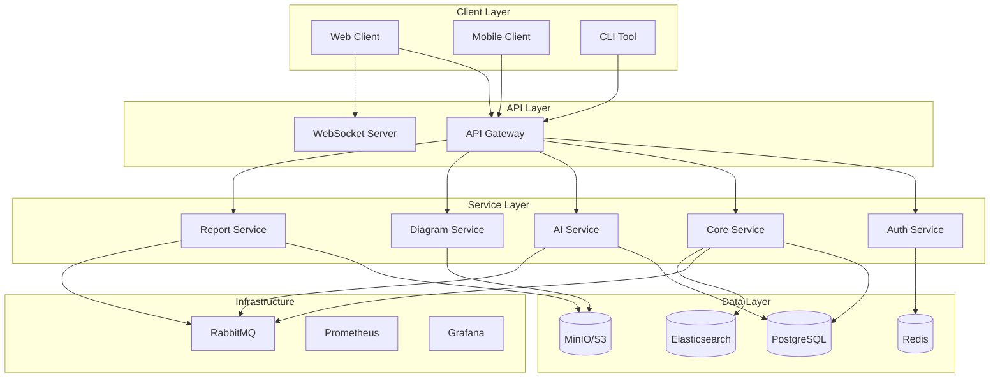

# Architecture Overview

## System Design Principles

The Threat Modeling Platform follows these architectural principles:

1. **Microservices Architecture**: Each service has a single responsibility and can be developed, deployed, and scaled independently
2. **API-First Design**: All functionality exposed through well-defined APIs (REST and GraphQL)
3. **Event-Driven Communication**: Services communicate asynchronously through message queues
4. **Security by Design**: Security considerations built into every component
5. **Cloud-Native**: Designed for containerized deployment and horizontal scaling

## High-Level Architecture

## Service Architecture

### Auth Service
- **Purpose**: Authentication and authorization
- **Technology**: Node.js, Express, Passport.js
- **Features**:
  - JWT token management
  - SSO/SAML/OIDC support
  - Role-based access control
  - Session management

### Core Service
- **Purpose**: Business logic and orchestration
- **Technology**: Node.js, TypeScript, TypeORM
- **Features**:
  - Project management
  - Threat model lifecycle
  - Methodology implementations
  - Integration coordination

### AI Service
- **Purpose**: Machine learning and AI features
- **Technology**: Python, FastAPI, TensorFlow/PyTorch
- **Features**:
  - Threat prediction
  - Natural language processing
  - Risk scoring algorithms
  - Pattern recognition

### Diagram Service
- **Purpose**: DFD processing and management
- **Technology**: Node.js, Canvas/SVG processing
- **Features**:
  - Diagram parsing
  - Element extraction
  - Trust boundary detection
  - Export functionality

### Report Service
- **Purpose**: Report generation and templates
- **Technology**: Node.js, Puppeteer, Handlebars
- **Features**:
  - PDF generation
  - HTML reports
  - Template management
  - Scheduled reports

## Data Architecture

### Primary Database (PostgreSQL)
- Projects and organizational data
- Threat models and threats
- User and team management
- Audit logs

### Cache Layer (Redis)
- Session storage
- API response caching
- Rate limiting data
- Real-time collaboration state

### Search Engine (Elasticsearch)
- Full-text search
- Threat analytics
- Log aggregation
- Performance metrics

### Object Storage (MinIO/S3)
- Diagram files
- Report outputs
- File attachments
- Backup storage

## Security Architecture

### Network Security
- TLS 1.3 for all communications
- Network segmentation
- Web Application Firewall
- DDoS protection

### Application Security
- Input validation at all layers
- Output encoding
- CSRF protection
- Security headers

### Data Security
- Encryption at rest
- Encryption in transit
- Key rotation
- Data classification

## Deployment Architecture

### Development
- Docker Compose
- Hot reload
- Local services
- Mock integrations

### Production
- Kubernetes deployment
- Auto-scaling
- Load balancing
- Health monitoring

### Disaster Recovery
- Automated backups
- Point-in-time recovery
- Geographic redundancy
- Failover procedures

## Integration Architecture

### External Integrations
- Jira/Azure DevOps
- GitHub/GitLab
- CI/CD pipelines
- Vulnerability scanners

### API Design
- RESTful endpoints
- GraphQL for complex queries
- WebSocket for real-time
- OpenAPI documentation

## Performance Architecture

### Caching Strategy
- Redis for hot data
- CDN for static assets
- Database query caching
- API response caching

### Scaling Strategy
- Horizontal pod autoscaling
- Database read replicas
- Async job processing
- Load distribution

## Monitoring Architecture

### Metrics Collection
- Prometheus metrics
- Custom business metrics
- Performance tracking
- Error rates

### Visualization
- Grafana dashboards
- Real-time alerts
- Historical analysis
- Capacity planning