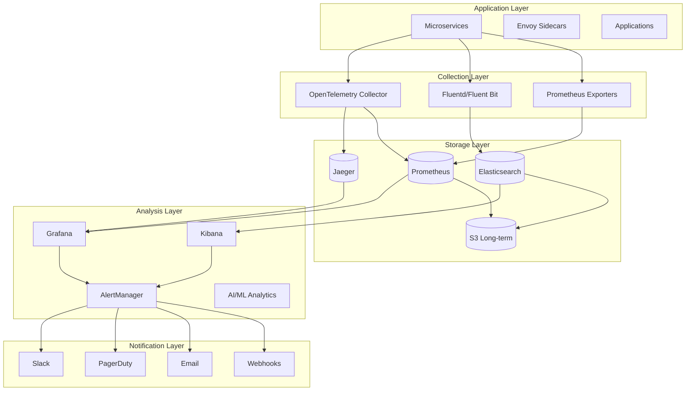

# Monitoring and Observability Design - Threat Modeling Application

## Overview

This document outlines the comprehensive monitoring and observability strategy for the Threat Modeling Application. The design implements the three pillars of observability: metrics, logs, and traces, along with alerting, visualization, and incident response procedures.

## Observability Architecture

### High-Level Architecture



## Metrics Collection

### Prometheus Configuration

```yaml
# prometheus/prometheus.yml
global:
  scrape_interval: 15s
  evaluation_interval: 15s
  external_labels:
    cluster: 'production'
    region: 'us-east-1'

# Alertmanager configuration
alerting:
  alertmanagers:
  - static_configs:
    - targets:
      - alertmanager:9093

# Load rules
rule_files:
  - "alerts/*.yml"
  - "recording/*.yml"

# Service discovery configuration
scrape_configs:
  # Kubernetes service discovery
  - job_name: 'kubernetes-apiservers'
    kubernetes_sd_configs:
    - role: endpoints
    scheme: https
    tls_config:
      ca_file: /var/run/secrets/kubernetes.io/serviceaccount/ca.crt
    bearer_token_file: /var/run/secrets/kubernetes.io/serviceaccount/token
    relabel_configs:
    - source_labels: [__meta_kubernetes_namespace, __meta_kubernetes_service_name, __meta_kubernetes_endpoint_port_name]
      action: keep
      regex: default;kubernetes;https

  # Node metrics
  - job_name: 'kubernetes-nodes'
    kubernetes_sd_configs:
    - role: node
    scheme: https
    tls_config:
      ca_file: /var/run/secrets/kubernetes.io/serviceaccount/ca.crt
    bearer_token_file: /var/run/secrets/kubernetes.io/serviceaccount/token
    relabel_configs:
    - action: labelmap
      regex: __meta_kubernetes_node_label_(.+)
    - target_label: __address__
      replacement: kubernetes.default.svc:443
    - source_labels: [__meta_kubernetes_node_name]
      regex: (.+)
      target_label: __metrics_path__
      replacement: /api/v1/nodes/${1}/proxy/metrics

  # Pod metrics
  - job_name: 'kubernetes-pods'
    kubernetes_sd_configs:
    - role: pod
    relabel_configs:
    - source_labels: [__meta_kubernetes_pod_annotation_prometheus_io_scrape]
      action: keep
      regex: true
    - source_labels: [__meta_kubernetes_pod_annotation_prometheus_io_path]
      action: replace
      target_label: __metrics_path__
      regex: (.+)
    - source_labels: [__address__, __meta_kubernetes_pod_annotation_prometheus_io_port]
      action: replace
      regex: ([^:]+)(?::\d+)?;(\d+)
      replacement: $1:$2
      target_label: __address__
    - action: labelmap
      regex: __meta_kubernetes_pod_label_(.+)
    - source_labels: [__meta_kubernetes_namespace]
      action: replace
      target_label: kubernetes_namespace
    - source_labels: [__meta_kubernetes_pod_name]
      action: replace
      target_label: kubernetes_pod_name

  # Service mesh metrics
  - job_name: 'istio-mesh'
    kubernetes_sd_configs:
    - role: endpoints
      namespaces:
        names:
        - istio-system
        - threatmodel-prod
    relabel_configs:
    - source_labels: [__meta_kubernetes_service_name, __meta_kubernetes_endpoint_port_name]
      action: keep
      regex: istio-telemetry;prometheus
```

### Application Metrics

```typescript
// instrumentation/metrics.ts
import { register, Counter, Histogram, Gauge, Summary } from 'prom-client';
import { Request, Response, NextFunction } from 'express';

// Define metrics
const httpRequestDuration = new Histogram({
  name: 'http_request_duration_seconds',
  help: 'Duration of HTTP requests in seconds',
  labelNames: ['method', 'route', 'status_code'],
  buckets: [0.1, 0.3, 0.5, 0.7, 1, 3, 5, 7, 10],
});

const httpRequestTotal = new Counter({
  name: 'http_requests_total',
  help: 'Total number of HTTP requests',
  labelNames: ['method', 'route', 'status_code'],
});

const activeConnections = new Gauge({
  name: 'http_active_connections',
  help: 'Number of active HTTP connections',
});

const businessMetrics = {
  threatsIdentified: new Counter({
    name: 'threats_identified_total',
    help: 'Total number of threats identified',
    labelNames: ['severity', 'category', 'methodology'],
  }),
  
  modelsCreated: new Counter({
    name: 'threat_models_created_total',
    help: 'Total number of threat models created',
    labelNames: ['project_type', 'methodology'],
  }),
  
  analysisTime: new Summary({
    name: 'threat_analysis_duration_seconds',
    help: 'Time taken to analyze threats',
    labelNames: ['model_size', 'methodology'],
    percentiles: [0.5, 0.9, 0.95, 0.99],
  }),
  
  userActivity: new Gauge({
    name: 'active_users',
    help: 'Number of active users',
    labelNames: ['organization', 'role'],
  }),
};

// Middleware for HTTP metrics
export const metricsMiddleware = (req: Request, res: Response, next: NextFunction) => {
  const start = Date.now();
  
  activeConnections.inc();
  
  res.on('finish', () => {
    const duration = (Date.now() - start) / 1000;
    const route = req.route?.path || req.path;
    const labels = {
      method: req.method,
      route,
      status_code: res.statusCode.toString(),
    };
    
    httpRequestDuration.observe(labels, duration);
    httpRequestTotal.inc(labels);
    activeConnections.dec();
  });
  
  next();
};

// Custom metrics helpers
export const recordThreatIdentified = (severity: string, category: string, methodology: string) => {
  businessMetrics.threatsIdentified.inc({ severity, category, methodology });
};

export const recordModelCreated = (projectType: string, methodology: string) => {
  businessMetrics.modelsCreated.inc({ project_type: projectType, methodology });
};

export const recordAnalysisTime = (duration: number, modelSize: string, methodology: string) => {
  businessMetrics.analysisTime.observe({ model_size: modelSize, methodology }, duration);
};

// Register all metrics
register.registerMetric(httpRequestDuration);
register.registerMetric(httpRequestTotal);
register.registerMetric(activeConnections);
Object.values(businessMetrics).forEach(metric => register.registerMetric(metric));

// Metrics endpoint
export const metricsHandler = (req: Request, res: Response) => {
  res.set('Content-Type', register.contentType);
  res.end(register.metrics());
};
```

### Custom Metrics

```yaml
# Custom business metrics
custom_metrics:
  security_metrics:
    - name: threat_detection_rate
      type: gauge
      help: "Rate of threat detection per model"
      labels: [methodology, severity]
      
    - name: mitigation_effectiveness
      type: histogram
      help: "Effectiveness of threat mitigations"
      labels: [threat_type, mitigation_type]
      buckets: [0.1, 0.25, 0.5, 0.75, 0.9, 0.95, 0.99]
      
    - name: compliance_score
      type: gauge
      help: "Compliance score by framework"
      labels: [framework, organization]
      
  performance_metrics:
    - name: model_analysis_duration
      type: summary
      help: "Time to analyze threat model"
      labels: [size, complexity]
      quantiles: [0.5, 0.9, 0.95, 0.99]
      
    - name: api_rate_limit_hits
      type: counter
      help: "Number of rate limit hits"
      labels: [endpoint, user_tier]
      
  business_metrics:
    - name: user_engagement
      type: gauge
      help: "User engagement metrics"
      labels: [action, user_role]
      
    - name: feature_adoption
      type: counter
      help: "Feature adoption tracking"
      labels: [feature, user_segment]
```

## Logging Architecture

### Structured Logging

```typescript
// logging/logger.ts
import winston from 'winston';
import { ElasticsearchTransport } from 'winston-elasticsearch';

const esTransportOpts = {
  level: 'info',
  clientOpts: {
    node: process.env.ELASTICSEARCH_URL || 'http://localhost:9200',
    auth: {
      username: process.env.ELASTICSEARCH_USER,
      password: process.env.ELASTICSEARCH_PASS,
    },
  },
  index: 'threatmodel-logs',
  format: winston.format.combine(
    winston.format.timestamp(),
    winston.format.errors({ stack: true }),
    winston.format.json()
  ),
};

export const logger = winston.createLogger({
  level: process.env.LOG_LEVEL || 'info',
  format: winston.format.combine(
    winston.format.timestamp({
      format: 'YYYY-MM-DD HH:mm:ss.SSS',
    }),
    winston.format.errors({ stack: true }),
    winston.format.splat(),
    winston.format.json()
  ),
  defaultMeta: {
    service: process.env.SERVICE_NAME,
    version: process.env.SERVICE_VERSION,
    environment: process.env.NODE_ENV,
    hostname: process.env.HOSTNAME,
  },
  transports: [
    new winston.transports.Console({
      format: winston.format.combine(
        winston.format.colorize(),
        winston.format.simple()
      ),
    }),
    new ElasticsearchTransport(esTransportOpts),
  ],
});

// Request logging middleware
export const requestLogger = (req: Request, res: Response, next: NextFunction) => {
  const requestId = req.headers['x-request-id'] || uuidv4();
  req.id = requestId;
  
  const startTime = Date.now();
  
  // Log request
  logger.info('Request received', {
    requestId,
    method: req.method,
    path: req.path,
    query: req.query,
    ip: req.ip,
    userAgent: req.headers['user-agent'],
    userId: req.user?.id,
  });
  
  // Log response
  const originalSend = res.send;
  res.send = function(data) {
    res.send = originalSend;
    
    const duration = Date.now() - startTime;
    
    logger.info('Request completed', {
      requestId,
      statusCode: res.statusCode,
      duration,
      contentLength: res.get('content-length'),
    });
    
    if (res.statusCode >= 400) {
      logger.error('Request failed', {
        requestId,
        statusCode: res.statusCode,
        error: data,
      });
    }
    
    return res.send(data);
  };
  
  next();
};

// Structured logging helpers
export const logSecurityEvent = (event: SecurityEvent) => {
  logger.warn('Security event', {
    eventType: event.type,
    severity: event.severity,
    userId: event.userId,
    ip: event.ip,
    details: event.details,
    timestamp: new Date().toISOString(),
  });
};

export const logBusinessEvent = (event: BusinessEvent) => {
  logger.info('Business event', {
    eventType: event.type,
    userId: event.userId,
    organizationId: event.organizationId,
    metadata: event.metadata,
    timestamp: new Date().toISOString(),
  });
};

export const logError = (error: Error, context?: any) => {
  logger.error('Application error', {
    message: error.message,
    stack: error.stack,
    code: error.code,
    context,
    timestamp: new Date().toISOString(),
  });
};
```

### Log Aggregation Configuration

```yaml
# fluent-bit/fluent-bit.yaml
apiVersion: v1
kind: ConfigMap
metadata:
  name: fluent-bit-config
  namespace: threatmodel-monitoring
data:
  fluent-bit.conf: |
    [SERVICE]
        Daemon Off
        Flush 1
        Log_Level info
        Parsers_File parsers.conf
        Parsers_File custom_parsers.conf
        HTTP_Server On
        HTTP_Listen 0.0.0.0
        HTTP_Port 2020
        Health_Check On

    [INPUT]
        Name tail
        Path /var/log/containers/*.log
        Parser docker
        Tag kube.*
        Refresh_Interval 5
        Mem_Buf_Limit 50MB
        Skip_Long_Lines On
        DB /var/log/flb_kube.db
        DB.Sync Normal

    [FILTER]
        Name kubernetes
        Match kube.*
        Kube_URL https://kubernetes.default.svc:443
        Kube_CA_File /var/run/secrets/kubernetes.io/serviceaccount/ca.crt
        Kube_Token_File /var/run/secrets/kubernetes.io/serviceaccount/token
        Kube_Tag_Prefix kube.var.log.containers.
        Merge_Log On
        Keep_Log Off
        K8S-Logging.Parser On
        K8S-Logging.Exclude On

    [FILTER]
        Name nest
        Match kube.*
        Operation lift
        Nested_under kubernetes
        Add_prefix k8s_

    [FILTER]
        Name modify
        Match kube.*
        Add cluster_name production
        Add region us-east-1

    [OUTPUT]
        Name es
        Match kube.*
        Host elasticsearch.threatmodel-monitoring.svc.cluster.local
        Port 9200
        Index threatmodel-logs
        Type _doc
        Retry_Limit 5
        Buffer_Size 10MB
        tls On
        tls.verify Off

    [OUTPUT]
        Name s3
        Match kube.*
        bucket threatmodel-logs-archive
        region us-east-1
        use_put_object On
        total_file_size 50M
        upload_timeout 10m
        store_dir /tmp/fluent-bit/s3

  custom_parsers.conf: |
    [PARSER]
        Name json_parser
        Format json
        Time_Key timestamp
        Time_Format %Y-%m-%dT%H:%M:%S.%LZ
        Time_Keep On

    [PARSER]
        Name threatmodel_app
        Format regex
        Regex ^(?<timestamp>[^ ]+) (?<level>[^ ]+) \[(?<service>[^\]]+)\] (?<message>.*)$
        Time_Key timestamp
        Time_Format %Y-%m-%d %H:%M:%S.%L
```

### Log Retention and Archival

```yaml
# elasticsearch/ilm-policy.json
{
  "policy": {
    "phases": {
      "hot": {
        "min_age": "0ms",
        "actions": {
          "rollover": {
            "max_primary_shard_size": "50GB",
            "max_age": "7d"
          },
          "set_priority": {
            "priority": 100
          }
        }
      },
      "warm": {
        "min_age": "7d",
        "actions": {
          "set_priority": {
            "priority": 50
          },
          "allocate": {
            "number_of_replicas": 1
          },
          "shrink": {
            "number_of_shards": 1
          },
          "forcemerge": {
            "max_num_segments": 1
          }
        }
      },
      "cold": {
        "min_age": "30d",
        "actions": {
          "set_priority": {
            "priority": 0
          },
          "allocate": {
            "require": {
              "data": "cold"
            }
          }
        }
      },
      "delete": {
        "min_age": "90d",
        "actions": {
          "delete": {}
        }
      }
    }
  }
}
```

## Distributed Tracing

### OpenTelemetry Configuration

```typescript
// tracing/tracer.ts
import { NodeSDK } from '@opentelemetry/sdk-node';
import { getNodeAutoInstrumentations } from '@opentelemetry/auto-instrumentations-node';
import { JaegerExporter } from '@opentelemetry/exporter-jaeger';
import { Resource } from '@opentelemetry/resources';
import { SemanticResourceAttributes } from '@opentelemetry/semantic-conventions';
import { BatchSpanProcessor } from '@opentelemetry/sdk-trace-base';

const jaegerExporter = new JaegerExporter({
  endpoint: process.env.JAEGER_ENDPOINT || 'http://localhost:14268/api/traces',
});

const resource = Resource.default().merge(
  new Resource({
    [SemanticResourceAttributes.SERVICE_NAME]: process.env.SERVICE_NAME,
    [SemanticResourceAttributes.SERVICE_VERSION]: process.env.SERVICE_VERSION,
    [SemanticResourceAttributes.DEPLOYMENT_ENVIRONMENT]: process.env.NODE_ENV,
  }),
);

const sdk = new NodeSDK({
  resource,
  spanProcessor: new BatchSpanProcessor(jaegerExporter),
  instrumentations: [
    getNodeAutoInstrumentations({
      '@opentelemetry/instrumentation-fs': {
        enabled: false,
      },
    }),
  ],
});

// Initialize tracing
sdk.start();

// Custom span creation
import { trace, context, SpanStatusCode } from '@opentelemetry/api';

const tracer = trace.getTracer(
  process.env.SERVICE_NAME || 'threat-modeling-app',
  process.env.SERVICE_VERSION || '1.0.0',
);

export const createSpan = (name: string, fn: Function) => {
  return tracer.startActiveSpan(name, async (span) => {
    try {
      const result = await fn();
      span.setStatus({ code: SpanStatusCode.OK });
      return result;
    } catch (error) {
      span.setStatus({
        code: SpanStatusCode.ERROR,
        message: error.message,
      });
      span.recordException(error);
      throw error;
    } finally {
      span.end();
    }
  });
};

// Trace context propagation
export const injectTraceContext = (headers: Record<string, string>): Record<string, string> => {
  const carrier = {};
  propagation.inject(context.active(), carrier);
  return { ...headers, ...carrier };
};

// Example usage in service
export const analyzeThreatModel = async (modelId: string) => {
  return createSpan('analyzeThreatModel', async () => {
    const span = trace.getActiveSpan();
    
    span?.setAttributes({
      'model.id': modelId,
      'model.type': 'threat_model',
    });
    
    // Fetch model
    const model = await createSpan('fetchModel', () => 
      db.query('SELECT * FROM threat_models WHERE id = $1', [modelId])
    );
    
    // Analyze threats
    const threats = await createSpan('analyzeThreats', () =>
      threatEngine.analyze(model)
    );
    
    span?.addEvent('analysis_completed', {
      threat_count: threats.length,
    });
    
    return threats;
  });
};
```

### Jaeger Configuration

```yaml
# jaeger/jaeger-deployment.yaml
apiVersion: apps/v1
kind: Deployment
metadata:
  name: jaeger
  namespace: threatmodel-monitoring
spec:
  replicas: 1
  selector:
    matchLabels:
      app: jaeger
  template:
    metadata:
      labels:
        app: jaeger
    spec:
      containers:
      - name: jaeger
        image: jaegertracing/all-in-one:1.50
        ports:
        - containerPort: 5775
          protocol: UDP
          name: zk-compact-trft
        - containerPort: 6831
          protocol: UDP
          name: jg-compact-trft
        - containerPort: 6832
          protocol: UDP
          name: jg-binary-trft
        - containerPort: 5778
          protocol: TCP
          name: config-rest
        - containerPort: 16686
          protocol: TCP
          name: query-http
        - containerPort: 14268
          protocol: TCP
          name: col-http
        - containerPort: 14250
          protocol: TCP
          name: col-grpc
        - containerPort: 9411
          protocol: TCP
          name: zipkin
        env:
        - name: COLLECTOR_ZIPKIN_HOST_PORT
          value: ":9411"
        - name: SPAN_STORAGE_TYPE
          value: elasticsearch
        - name: ES_SERVER_URLS
          value: http://elasticsearch:9200
        - name: ES_TAGS_AS_FIELDS_ALL
          value: "true"
        - name: ES_NUM_SHARDS
          value: "3"
        - name: ES_NUM_REPLICAS
          value: "1"
        resources:
          requests:
            memory: "1Gi"
            cpu: "500m"
          limits:
            memory: "2Gi"
            cpu: "1000m"
```

## Alerting Configuration

### Alert Rules

```yaml
# alerts/application-alerts.yaml
groups:
  - name: application
    interval: 30s
    rules:
      # Availability alerts
      - alert: ServiceDown
        expr: up{job=~".*-service"} == 0
        for: 5m
        labels:
          severity: critical
          team: platform
        annotations:
          summary: "Service {{ $labels.job }} is down"
          description: "{{ $labels.job }} has been down for more than 5 minutes"
          runbook_url: "https://wiki.threatmodel.io/runbooks/service-down"

      # Performance alerts
      - alert: HighResponseTime
        expr: |
          histogram_quantile(0.95,
            sum(rate(http_request_duration_seconds_bucket[5m])) by (service, le)
          ) > 1
        for: 5m
        labels:
          severity: warning
          team: platform
        annotations:
          summary: "High response time on {{ $labels.service }}"
          description: "95th percentile response time is {{ $value }}s"

      - alert: HighErrorRate
        expr: |
          sum(rate(http_requests_total{status=~"5.."}[5m])) by (service)
          /
          sum(rate(http_requests_total[5m])) by (service)
          > 0.05
        for: 5m
        labels:
          severity: critical
          team: platform
        annotations:
          summary: "High error rate on {{ $labels.service }}"
          description: "{{ $labels.service }} error rate is {{ $value | humanizePercentage }}"

      # Resource alerts
      - alert: HighMemoryUsage
        expr: |
          container_memory_usage_bytes{pod!=""}
          /
          container_spec_memory_limit_bytes{pod!=""}
          > 0.9
        for: 5m
        labels:
          severity: warning
          team: platform
        annotations:
          summary: "High memory usage in {{ $labels.pod }}"
          description: "Pod {{ $labels.pod }} memory usage is {{ $value | humanizePercentage }}"

      - alert: PodCrashLooping
        expr: rate(kube_pod_container_status_restarts_total[15m]) > 0
        for: 5m
        labels:
          severity: critical
          team: platform
        annotations:
          summary: "Pod {{ $labels.pod }} is crash looping"
          description: "Pod {{ $labels.pod }} has restarted {{ $value }} times in 15 minutes"

      # Business metrics alerts
      - alert: LowThreatDetectionRate
        expr: |
          rate(threats_identified_total[1h]) < 0.1
          and
          rate(threat_models_created_total[1h]) > 0
        for: 30m
        labels:
          severity: warning
          team: security
        annotations:
          summary: "Low threat detection rate"
          description: "Threat detection rate has dropped below threshold"

      - alert: HighAnalysisTime
        expr: |
          threat_analysis_duration_seconds{quantile="0.95"} > 300
        for: 15m
        labels:
          severity: warning
          team: engineering
        annotations:
          summary: "Threat analysis taking too long"
          description: "95th percentile analysis time is {{ $value }}s"

  - name: security
    interval: 1m
    rules:
      - alert: MultipleFailedLogins
        expr: |
          sum(rate(authentication_failures_total[5m])) by (user_id) > 0.5
        for: 5m
        labels:
          severity: warning
          team: security
        annotations:
          summary: "Multiple failed login attempts for user {{ $labels.user_id }}"
          description: "User {{ $labels.user_id }} has {{ $value }} failed login attempts per second"

      - alert: UnauthorizedAPIAccess
        expr: |
          sum(rate(http_requests_total{status="403"}[5m])) by (path) > 1
        for: 5m
        labels:
          severity: critical
          team: security
        annotations:
          summary: "High rate of unauthorized access to {{ $labels.path }}"
          description: "{{ $value }} unauthorized requests per second to {{ $labels.path }}"

      - alert: SuspiciousDataAccess
        expr: |
          sum(rate(data_access_total{sensitivity="high"}[5m])) by (user_id)
          > 
          avg(sum(rate(data_access_total{sensitivity="high"}[1h])) by (user_id)) * 10
        for: 5m
        labels:
          severity: critical
          team: security
        annotations:
          summary: "Suspicious data access pattern for user {{ $labels.user_id }}"
          description: "User {{ $labels.user_id }} accessing sensitive data at 10x normal rate"
```

### AlertManager Configuration

```yaml
# alertmanager/config.yaml
global:
  resolve_timeout: 5m
  slack_api_url: '${SLACK_API_URL}'
  pagerduty_url: 'https://events.pagerduty.com/v2/enqueue'

templates:
  - '/etc/alertmanager/templates/*.tmpl'

route:
  group_by: ['alertname', 'cluster', 'service']
  group_wait: 10s
  group_interval: 10s
  repeat_interval: 12h
  receiver: 'default'
  
  routes:
  # Critical alerts go to PagerDuty
  - match:
      severity: critical
    receiver: pagerduty
    continue: true
    
  # Security alerts go to security team
  - match:
      team: security
    receiver: security-team
    continue: true
    
  # Warning alerts go to Slack
  - match:
      severity: warning
    receiver: slack-warnings
    
  # Business alerts go to product team
  - match_re:
      alertname: ^(Low.*|High.*Analysis.*)
    receiver: product-team

receivers:
  - name: 'default'
    slack_configs:
    - channel: '#alerts'
      title: 'Alert: {{ .GroupLabels.alertname }}'
      text: '{{ range .Alerts }}{{ .Annotations.summary }}\n{{ end }}'
      send_resolved: true

  - name: 'pagerduty'
    pagerduty_configs:
    - service_key: '${PAGERDUTY_SERVICE_KEY}'
      description: '{{ .GroupLabels.alertname }}: {{ .CommonAnnotations.summary }}'
      details:
        firing: '{{ .Alerts.Firing | len }}'
        resolved: '{{ .Alerts.Resolved | len }}'
        alerts: '{{ range .Alerts }}{{ .Labels.alertname }}: {{ .Annotations.description }}\n{{ end }}'

  - name: 'security-team'
    slack_configs:
    - channel: '#security-alerts'
      title: '🚨 Security Alert: {{ .GroupLabels.alertname }}'
      text: |
        {{ range .Alerts }}
        *Alert:* {{ .Labels.alertname }}
        *Description:* {{ .Annotations.description }}
        *Severity:* {{ .Labels.severity }}
        *Time:* {{ .StartsAt.Format "2006-01-02 15:04:05" }}
        {{ end }}
      send_resolved: true
    email_configs:
    - to: 'security-team@threatmodel.io'
      headers:
        Subject: 'Security Alert: {{ .GroupLabels.alertname }}'

  - name: 'slack-warnings'
    slack_configs:
    - channel: '#alerts-warnings'
      title: '⚠️ Warning: {{ .GroupLabels.alertname }}'
      text: '{{ .CommonAnnotations.summary }}'
      send_resolved: true

  - name: 'product-team'
    slack_configs:
    - channel: '#product-metrics'
      title: '📊 Product Alert: {{ .GroupLabels.alertname }}'
      text: '{{ .CommonAnnotations.description }}'

inhibit_rules:
  - source_match:
      severity: 'critical'
    target_match:
      severity: 'warning'
    equal: ['alertname', 'cluster', 'service']
```

## Dashboards and Visualization

### Grafana Dashboard Configuration

```json
{
  "dashboard": {
    "title": "Threat Modeling Application Overview",
    "uid": "threatmodel-overview",
    "panels": [
      {
        "title": "Service Health",
        "gridPos": { "h": 8, "w": 12, "x": 0, "y": 0 },
        "type": "stat",
        "targets": [
          {
            "expr": "sum(up{job=~\".*-service\"}) / count(up{job=~\".*-service\"}) * 100",
            "refId": "A"
          }
        ],
        "fieldConfig": {
          "defaults": {
            "thresholds": {
              "mode": "absolute",
              "steps": [
                { "color": "red", "value": null },
                { "color": "yellow", "value": 95 },
                { "color": "green", "value": 99 }
              ]
            },
            "unit": "percent"
          }
        }
      },
      {
        "title": "Request Rate",
        "gridPos": { "h": 8, "w": 12, "x": 12, "y": 0 },
        "type": "graph",
        "targets": [
          {
            "expr": "sum(rate(http_requests_total[5m])) by (service)",
            "legendFormat": "{{ service }}",
            "refId": "A"
          }
        ],
        "yaxes": [
          { "format": "reqps", "label": "Requests/sec" }
        ]
      },
      {
        "title": "Error Rate",
        "gridPos": { "h": 8, "w": 12, "x": 0, "y": 8 },
        "type": "graph",
        "targets": [
          {
            "expr": "sum(rate(http_requests_total{status=~\"5..\"}[5m])) by (service) / sum(rate(http_requests_total[5m])) by (service) * 100",
            "legendFormat": "{{ service }}",
            "refId": "A"
          }
        ],
        "yaxes": [
          { "format": "percent", "label": "Error %" }
        ],
        "alert": {
          "conditions": [
            {
              "evaluator": { "params": [5], "type": "gt" },
              "operator": { "type": "and" },
              "query": { "params": ["A", "5m", "now"] },
              "reducer": { "params": [], "type": "avg" },
              "type": "query"
            }
          ],
          "name": "High Error Rate Alert"
        }
      },
      {
        "title": "Response Time (P95)",
        "gridPos": { "h": 8, "w": 12, "x": 12, "y": 8 },
        "type": "graph",
        "targets": [
          {
            "expr": "histogram_quantile(0.95, sum(rate(http_request_duration_seconds_bucket[5m])) by (service, le))",
            "legendFormat": "{{ service }}",
            "refId": "A"
          }
        ],
        "yaxes": [
          { "format": "s", "label": "Response Time" }
        ]
      },
      {
        "title": "Active Users",
        "gridPos": { "h": 8, "w": 8, "x": 0, "y": 16 },
        "type": "stat",
        "targets": [
          {
            "expr": "sum(active_users)",
            "refId": "A"
          }
        ],
        "fieldConfig": {
          "defaults": {
            "unit": "short",
            "color": { "mode": "thresholds" },
            "thresholds": {
              "mode": "absolute",
              "steps": [
                { "color": "green", "value": null }
              ]
            }
          }
        }
      },
      {
        "title": "Threats Identified Today",
        "gridPos": { "h": 8, "w": 8, "x": 8, "y": 16 },
        "type": "stat",
        "targets": [
          {
            "expr": "sum(increase(threats_identified_total[24h]))",
            "refId": "A"
          }
        ],
        "fieldConfig": {
          "defaults": {
            "unit": "short",
            "color": { "mode": "thresholds" },
            "thresholds": {
              "mode": "absolute",
              "steps": [
                { "color": "blue", "value": null }
              ]
            }
          }
        }
      },
      {
        "title": "Models Created Today",
        "gridPos": { "h": 8, "w": 8, "x": 16, "y": 16 },
        "type": "stat",
        "targets": [
          {
            "expr": "sum(increase(threat_models_created_total[24h]))",
            "refId": "A"
          }
        ],
        "fieldConfig": {
          "defaults": {
            "unit": "short",
            "color": { "mode": "thresholds" },
            "thresholds": {
              "mode": "absolute",
              "steps": [
                { "color": "purple", "value": null }
              ]
            }
          }
        }
      }
    ]
  }
}
```

### Custom Business Dashboard

```json
{
  "dashboard": {
    "title": "Threat Modeling Business Metrics",
    "uid": "threatmodel-business",
    "panels": [
      {
        "title": "Threat Distribution by Severity",
        "type": "piechart",
        "targets": [
          {
            "expr": "sum(threats_identified_total) by (severity)",
            "legendFormat": "{{ severity }}",
            "refId": "A"
          }
        ]
      },
      {
        "title": "Methodology Usage",
        "type": "bargauge",
        "targets": [
          {
            "expr": "sum(threat_models_created_total) by (methodology)",
            "refId": "A"
          }
        ]
      },
      {
        "title": "Analysis Time Trends",
        "type": "graph",
        "targets": [
          {
            "expr": "threat_analysis_duration_seconds{quantile=\"0.5\"}",
            "legendFormat": "P50",
            "refId": "A"
          },
          {
            "expr": "threat_analysis_duration_seconds{quantile=\"0.95\"}",
            "legendFormat": "P95",
            "refId": "B"
          },
          {
            "expr": "threat_analysis_duration_seconds{quantile=\"0.99\"}",
            "legendFormat": "P99",
            "refId": "C"
          }
        ]
      },
      {
        "title": "Compliance Scores",
        "type": "gauge",
        "targets": [
          {
            "expr": "avg(compliance_score) by (framework)",
            "refId": "A"
          }
        ],
        "fieldConfig": {
          "defaults": {
            "max": 100,
            "min": 0,
            "unit": "percent",
            "thresholds": {
              "mode": "absolute",
              "steps": [
                { "color": "red", "value": null },
                { "color": "yellow", "value": 70 },
                { "color": "green", "value": 90 }
              ]
            }
          }
        }
      }
    ]
  }
}
```

## SLO/SLI Configuration

### Service Level Objectives

```yaml
# slo/slo-config.yaml
apiVersion: sloth.slok.dev/v1
kind: PrometheusServiceLevel
metadata:
  name: threatmodel-slos
  namespace: threatmodel-monitoring
spec:
  service: threat-modeling-app
  labels:
    team: platform
    tier: production
  slos:
    # Availability SLO
    - name: availability
      objective: 99.9
      description: "99.9% of requests should be successful"
      sli:
        events:
          error_query: |
            sum(rate(http_requests_total{status=~"5.."}[5m]))
          total_query: |
            sum(rate(http_requests_total[5m]))
      alerting:
        name: ThreatModelAvailability
        page_alert:
          labels:
            severity: critical
            team: platform

    # Latency SLO
    - name: latency
      objective: 95
      description: "95% of requests should complete in under 500ms"
      sli:
        events:
          error_query: |
            sum(rate(http_request_duration_seconds_bucket{le="0.5"}[5m]))
          total_query: |
            sum(rate(http_request_duration_seconds_count[5m]))
      alerting:
        name: ThreatModelLatency
        page_alert:
          labels:
            severity: warning
            team: platform

    # Threat Analysis SLO
    - name: threat-analysis
      objective: 99
      description: "99% of threat analyses should complete successfully"
      sli:
        events:
          error_query: |
            sum(rate(threat_analysis_failures_total[5m]))
          total_query: |
            sum(rate(threat_analysis_total[5m]))
      alerting:
        name: ThreatAnalysisReliability
        page_alert:
          labels:
            severity: critical
            team: security
```

### Error Budget Dashboard

```json
{
  "dashboard": {
    "title": "Error Budget Dashboard",
    "panels": [
      {
        "title": "Error Budget Remaining",
        "type": "stat",
        "targets": [
          {
            "expr": "(1 - (sum(increase(http_requests_total{status=~\"5..\"}[30d])) / sum(increase(http_requests_total[30d])))) * 100 - 99.9",
            "refId": "A"
          }
        ],
        "fieldConfig": {
          "defaults": {
            "unit": "percent",
            "thresholds": {
              "mode": "absolute",
              "steps": [
                { "color": "red", "value": null },
                { "color": "yellow", "value": 0.05 },
                { "color": "green", "value": 0.1 }
              ]
            }
          }
        }
      },
      {
        "title": "Error Budget Burn Rate",
        "type": "graph",
        "targets": [
          {
            "expr": "sum(rate(http_requests_total{status=~\"5..\"}[1h])) / sum(rate(http_requests_total[1h])) / (1 - 0.999)",
            "legendFormat": "Burn Rate",
            "refId": "A"
          }
        ]
      }
    ]
  }
}
```

## Incident Response

### Runbook Template

```markdown
# Runbook: Service Down

## Overview
This runbook provides steps to diagnose and resolve service downtime issues.

## Alert Details
- **Alert Name**: ServiceDown
- **Severity**: Critical
- **Team**: Platform

## Symptoms
- Service health check failing
- No response from service endpoints
- Prometheus target showing as down

## Diagnosis Steps

1. **Check Pod Status**
   ```bash
   kubectl get pods -n threatmodel-prod -l app=<service-name>
   kubectl describe pod <pod-name> -n threatmodel-prod
   ```

2. **Check Recent Events**
   ```bash
   kubectl get events -n threatmodel-prod --sort-by='.lastTimestamp' | grep <service-name>
   ```

3. **Check Logs**
   ```bash
   kubectl logs -n threatmodel-prod -l app=<service-name> --tail=100
   ```

4. **Check Resource Usage**
   ```bash
   kubectl top pods -n threatmodel-prod -l app=<service-name>
   ```

## Resolution Steps

1. **If Pods are Crashing**
   - Check for OOMKilled: Increase memory limits
   - Check for CrashLoopBackOff: Review logs for startup errors
   - Roll back to previous version if recent deployment

2. **If No Pods Running**
   - Check deployment status
   - Check for node issues
   - Scale deployment manually

3. **If Network Issues**
   - Check service endpoints
   - Verify network policies
   - Check ingress configuration

## Escalation
If issue persists after 15 minutes:
1. Page on-call engineer
2. Create incident channel in Slack
3. Update status page

## Post-Incident
1. Create post-mortem document
2. Update runbook with learnings
3. Create tickets for permanent fixes
```

### Incident Management Automation

```typescript
// incident/incident-manager.ts
export class IncidentManager {
  async createIncident(alert: Alert): Promise<Incident> {
    const incident = {
      id: uuidv4(),
      title: `${alert.labels.alertname} - ${alert.labels.service}`,
      severity: alert.labels.severity,
      status: 'open',
      createdAt: new Date(),
      alerts: [alert],
      timeline: [],
    };

    // Create Slack channel
    const channel = await this.slack.createChannel({
      name: `incident-${incident.id.slice(0, 8)}`,
      topic: incident.title,
    });

    // Page on-call
    if (incident.severity === 'critical') {
      await this.pagerduty.createIncident({
        title: incident.title,
        service_id: this.getServiceId(alert.labels.service),
        urgency: 'high',
      });
    }

    // Create status page incident
    await this.statusPage.createIncident({
      name: incident.title,
      status: 'investigating',
      impact: this.getImpact(incident.severity),
      components: [alert.labels.service],
    });

    // Log incident
    await this.auditLog.log({
      type: 'incident_created',
      incident,
      triggeredBy: alert,
    });

    return incident;
  }

  async updateIncident(incidentId: string, update: IncidentUpdate): Promise<void> {
    const incident = await this.getIncident(incidentId);
    
    // Update timeline
    incident.timeline.push({
      timestamp: new Date(),
      action: update.action,
      message: update.message,
      user: update.user,
    });

    // Update status
    if (update.status) {
      incident.status = update.status;
      
      // Update external systems
      await Promise.all([
        this.slack.postMessage({
          channel: incident.slackChannel,
          text: `Status updated to: ${update.status}\n${update.message}`,
        }),
        this.statusPage.updateIncident({
          id: incident.statusPageId,
          status: this.mapStatus(update.status),
          message: update.message,
        }),
      ]);
    }

    // Check if resolved
    if (update.status === 'resolved') {
      await this.resolveIncident(incident);
    }
  }

  private async resolveIncident(incident: Incident): Promise<void> {
    // Calculate metrics
    const duration = Date.now() - incident.createdAt.getTime();
    const mttr = duration / 1000 / 60; // minutes

    // Update metrics
    await this.metrics.recordIncident({
      service: incident.service,
      severity: incident.severity,
      duration,
      mttr,
    });

    // Schedule post-mortem
    if (incident.severity === 'critical') {
      await this.calendar.schedulePostMortem({
        incident,
        suggestedTime: this.getNextBusinessDay(),
        participants: this.getStakeholders(incident),
      });
    }

    // Archive Slack channel
    await this.slack.archiveChannel(incident.slackChannel);
  }
}
```

This comprehensive monitoring and observability design provides:

1. **Complete metrics collection** with Prometheus and custom business metrics
2. **Structured logging** with Elasticsearch and log aggregation
3. **Distributed tracing** with OpenTelemetry and Jaeger
4. **Comprehensive alerting** with severity-based routing
5. **Rich dashboards** for operational and business insights
6. **SLO/SLI tracking** with error budgets
7. **Incident response automation** with runbooks and tooling

The system ensures full visibility into application health, performance, and business metrics while providing automated incident response capabilities.