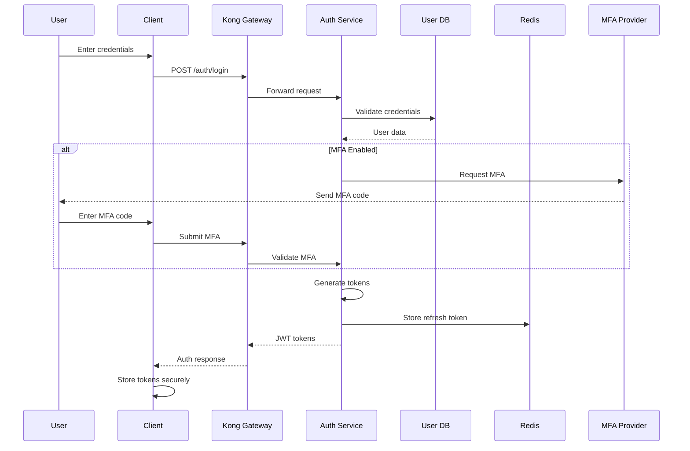
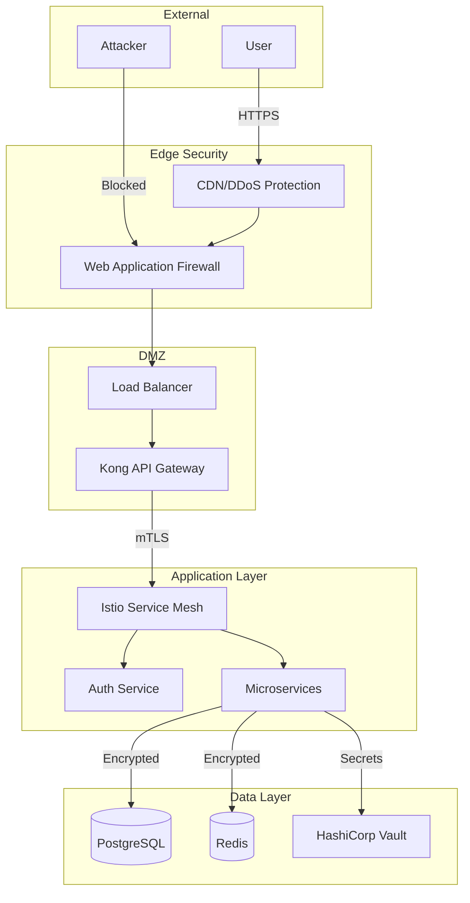
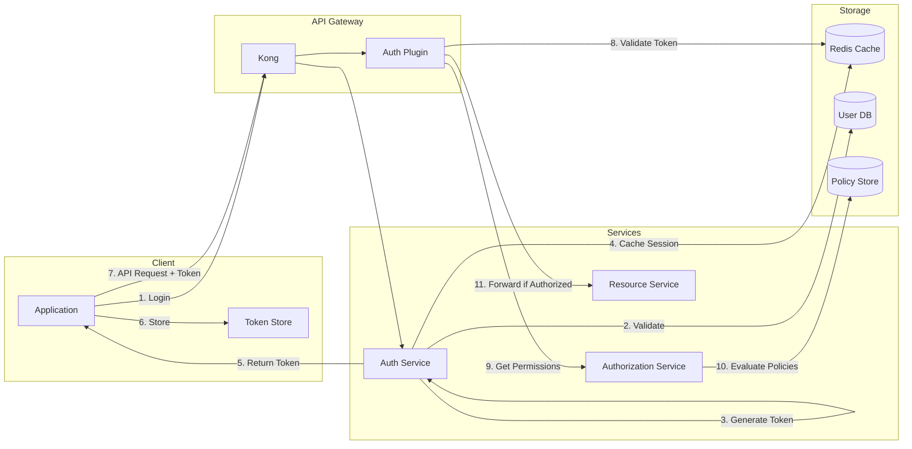

# Security Architecture - Threat Modeling Application

## Overview

This document defines the comprehensive security architecture for the Threat Modeling Application, covering authentication, authorization, encryption, and security policies. The architecture implements defense-in-depth principles with multiple layers of security controls.

## Security Principles

### Core Security Tenets
1. **Zero Trust Architecture**: Never trust, always verify
2. **Least Privilege**: Minimal permissions by default
3. **Defense in Depth**: Multiple security layers
4. **Secure by Design**: Security built-in, not bolted-on
5. **Fail Secure**: Deny by default on failures
6. **Complete Mediation**: All access checked
7. **Separation of Duties**: Role-based access control

## Authentication Architecture

### Authentication Flow Overview



### Authentication Methods

#### 1. Primary Authentication
```yaml
password_authentication:
  algorithm: bcrypt
  cost_factor: 12
  min_length: 12
  complexity_requirements:
    - uppercase: true
    - lowercase: true
    - numbers: true
    - special_chars: true
  password_history: 5
  max_age_days: 90
  lockout_policy:
    max_attempts: 5
    lockout_duration: 15_minutes
    reset_after: 24_hours
```

#### 2. Multi-Factor Authentication (MFA)
```yaml
mfa_options:
  totp:
    algorithm: SHA256
    digits: 6
    period: 30
    window: 1
    issuer: "ThreatModel.io"
    
  sms:
    provider: Twilio
    rate_limit: 3_per_hour
    code_length: 6
    expiry: 5_minutes
    
  webauthn:
    rp_name: "Threat Modeling App"
    rp_id: "threatmodel.io"
    attestation: direct
    user_verification: required
    
  backup_codes:
    count: 10
    length: 8
    single_use: true
```

#### 3. Single Sign-On (SSO)
```yaml
sso_providers:
  saml2:
    - provider: Okta
      metadata_url: https://okta.com/metadata
      attribute_mapping:
        email: urn:oid:0.9.2342.19200300.100.1.3
        name: urn:oid:2.5.4.3
        groups: urn:oid:1.3.6.1.4.1.5923.1.5.1.1
        
  oauth2:
    - provider: Google
      client_id: ${GOOGLE_CLIENT_ID}
      scopes: [openid, email, profile]
      
    - provider: GitHub
      client_id: ${GITHUB_CLIENT_ID}
      scopes: [user:email, read:org]
      
    - provider: Azure AD
      tenant_id: ${AZURE_TENANT_ID}
      client_id: ${AZURE_CLIENT_ID}
      scopes: [openid, email, profile, User.Read]
```

### JWT Token Structure

#### Access Token
```json
{
  "header": {
    "alg": "RS256",
    "typ": "JWT",
    "kid": "2024-01-key"
  },
  "payload": {
    "sub": "user_uuid",
    "iss": "https://api.threatmodel.io",
    "aud": "https://api.threatmodel.io",
    "exp": 1704070800,
    "iat": 1704067200,
    "jti": "unique_token_id",
    "org": "organization_uuid",
    "roles": ["security_analyst", "project_manager"],
    "permissions": ["threat:read", "threat:write", "project:admin"],
    "session_id": "session_uuid",
    "auth_time": 1704067200,
    "amr": ["pwd", "mfa", "otp"]
  }
}
```

#### Refresh Token
```json
{
  "payload": {
    "sub": "user_uuid",
    "jti": "refresh_token_id",
    "exp": 1704672000,
    "iat": 1704067200,
    "session_id": "session_uuid",
    "token_family": "family_id"
  }
}
```

### Session Management

```yaml
session_config:
  access_token_ttl: 15_minutes
  refresh_token_ttl: 7_days
  sliding_sessions: true
  concurrent_sessions: 5
  
  storage:
    provider: Redis
    encryption: AES-256-GCM
    
  tracking:
    - ip_address
    - user_agent
    - device_fingerprint
    - geolocation
    
  anomaly_detection:
    - impossible_travel
    - new_device
    - unusual_time
    - suspicious_activity
```

## Authorization Architecture

### RBAC/ABAC Hybrid Model

```yaml
authorization_model:
  type: hybrid_rbac_abac
  
  evaluation_order:
    1. role_based_permissions
    2. attribute_based_policies
    3. contextual_rules
    4. dynamic_permissions
```

### Role-Based Access Control (RBAC)

#### System Roles Hierarchy
```yaml
roles:
  system_admin:
    inherits: []
    permissions: ["*"]
    
  org_owner:
    inherits: [org_admin]
    permissions: 
      - organization:*
      - billing:*
      
  org_admin:
    inherits: [project_manager]
    permissions:
      - user:manage
      - team:manage
      - settings:manage
      
  project_manager:
    inherits: [security_analyst]
    permissions:
      - project:create
      - project:delete
      - project:settings
      
  security_analyst:
    inherits: [developer]
    permissions:
      - threat_model:create
      - threat_model:approve
      - threat:manage
      - report:generate
      
  developer:
    inherits: [reviewer]
    permissions:
      - threat_model:edit
      - threat:comment
      - integration:use
      
  reviewer:
    inherits: [viewer]
    permissions:
      - threat_model:review
      - threat:view_details
      
  viewer:
    inherits: []
    permissions:
      - project:read
      - threat_model:read
      - threat:read
      - report:read
```

### Attribute-Based Access Control (ABAC)

#### Policy Engine
```python
# Policy Definition Language
policy "can_edit_threat_model" {
  description = "User can edit threat model if they are assigned to the project"
  
  when {
    subject.id in resource.project.assigned_users
    AND resource.status != "approved"
    AND action == "threat_model:edit"
  }
  
  effect = "allow"
}

policy "can_approve_threat_model" {
  description = "Only senior analysts can approve high-risk models"
  
  when {
    resource.risk_level == "high"
    AND subject.seniority_level >= 3
    AND subject.has_role("security_analyst")
    AND action == "threat_model:approve"
  }
  
  effect = "allow"
}

policy "data_classification_access" {
  description = "Access based on data classification"
  
  when {
    resource.data_classification == "secret"
    AND NOT subject.clearance_level >= "secret"
  }
  
  effect = "deny"
  priority = 100  # High priority denial
}
```

#### Context-Aware Permissions
```yaml
contextual_rules:
  time_based:
    - rule: "no_weekend_admin"
      condition: "is_weekend() AND action.category == 'admin'"
      effect: "deny"
      
  location_based:
    - rule: "geo_restriction"
      condition: "subject.country NOT IN allowed_countries"
      effect: "deny"
      
  risk_based:
    - rule: "high_risk_mfa"
      condition: "risk_score > 0.7"
      requirement: "additional_mfa"
```

### Permission Model

```yaml
permission_structure:
  format: "resource:action:scope"
  
  examples:
    - "project:read:own"      # Read own projects
    - "project:read:team"     # Read team projects
    - "project:read:org"      # Read org projects
    - "threat:write:*"        # Write any threat
    - "report:generate:pdf"   # Generate PDF reports
    
  wildcards:
    - "*:*:*"                 # Full access
    - "project:*:own"         # All actions on own projects
    - "*:read:*"              # Read everything
```

## Encryption Architecture

### Encryption Standards

```yaml
encryption_standards:
  data_at_rest:
    algorithm: AES-256-GCM
    key_derivation: PBKDF2-SHA256
    iterations: 100000
    
  data_in_transit:
    tls_version: "1.3"
    cipher_suites:
      - TLS_AES_256_GCM_SHA384
      - TLS_CHACHA20_POLY1305_SHA256
      - TLS_AES_128_GCM_SHA256
    certificate_pinning: true
    
  database_encryption:
    transparent_encryption: true
    column_encryption:
      algorithm: AES-256-CBC
      mode: deterministic  # For searchable fields
    field_encryption:
      algorithm: AES-256-GCM
      mode: randomized     # For sensitive data
```

### Key Management

```yaml
key_management:
  provider: "HashiCorp Vault"
  
  key_hierarchy:
    master_key:
      location: HSM
      rotation: 90_days
      algorithm: AES-256
      
    data_encryption_keys:
      derivation: HKDF-SHA256
      rotation: 30_days
      versioning: true
      
    api_keys:
      algorithm: HMAC-SHA256
      rotation: never  # Revoke instead
      
  key_usage:
    - purpose: jwt_signing
      algorithm: RS256
      key_size: 4096
      rotation: 30_days
      
    - purpose: database_encryption
      algorithm: AES-256-GCM
      rotation: 90_days
      
    - purpose: file_encryption
      algorithm: ChaCha20-Poly1305
      rotation: 180_days
```

### Cryptographic Operations

```yaml
crypto_operations:
  password_hashing:
    algorithm: bcrypt
    cost: 12
    pepper: ${PEPPER_SECRET}
    
  token_generation:
    access_token: RS256 with RSA-4096
    refresh_token: HS256 with random-256-bit
    api_key: HMAC-SHA256
    
  data_integrity:
    algorithm: HMAC-SHA256
    key_rotation: 30_days
    
  secure_random:
    source: /dev/urandom
    entropy_pool: 256_bits
```

## Security Policies

### Access Control Policies

```yaml
access_policies:
  default_deny:
    description: "Deny all access by default"
    priority: 0
    effect: deny
    
  authentication_required:
    description: "All API calls require authentication"
    priority: 10
    condition: "request.path != '/health' AND request.path != '/auth/*'"
    requirement: valid_jwt_token
    
  organization_boundary:
    description: "Users can only access their organization's data"
    priority: 20
    condition: "resource.org_id != subject.org_id"
    effect: deny
    
  ip_allowlist:
    description: "Admin access from allowed IPs only"
    priority: 30
    condition: "subject.has_role('admin') AND request.ip NOT IN admin_ip_allowlist"
    effect: deny
```

### Data Protection Policies

```yaml
data_protection:
  pii_handling:
    encryption: required
    retention: 90_days
    anonymization: after_retention
    audit: all_access
    
  data_classification:
    levels:
      - public: no_restrictions
      - internal: organization_only
      - confidential: need_to_know
      - secret: special_access
      
  data_loss_prevention:
    email_filtering: true
    file_scanning: true
    api_monitoring: true
    watermarking: true
```

### Audit and Compliance Policies

```yaml
audit_policies:
  events_to_log:
    - authentication_attempts
    - authorization_decisions
    - data_access
    - configuration_changes
    - privilege_escalation
    - data_exports
    - api_calls
    
  log_retention:
    security_events: 2_years
    access_logs: 1_year
    application_logs: 90_days
    
  compliance_controls:
    gdpr:
      - right_to_access
      - right_to_deletion
      - data_portability
      - consent_management
      
    hipaa:
      - access_controls
      - audit_logs
      - integrity_controls
      - transmission_security
      
    soc2:
      - change_management
      - risk_assessment
      - incident_response
      - vendor_management
```

### Incident Response Policies

```yaml
incident_response:
  severity_levels:
    critical:
      response_time: 15_minutes
      escalation: immediate
      examples:
        - data_breach
        - system_compromise
        - ransomware
        
    high:
      response_time: 1_hour
      escalation: 2_hours
      examples:
        - unauthorized_access
        - suspicious_activity
        - failed_security_control
        
    medium:
      response_time: 4_hours
      escalation: 24_hours
      examples:
        - policy_violation
        - misconfiguration
        - unusual_pattern
        
    low:
      response_time: 24_hours
      escalation: 72_hours
      examples:
        - failed_login_attempts
        - minor_anomaly
        
  response_procedures:
    1. detect_and_analyze
    2. contain_and_eradicate
    3. recover_and_restore
    4. post_incident_review
    5. lessons_learned
```

## Security Controls

### Network Security

```yaml
network_security:
  firewall_rules:
    default: deny_all
    allowed:
      - source: load_balancer
        destination: api_gateway
        ports: [443]
        
      - source: api_gateway
        destination: services
        ports: [8080]
        
      - source: services
        destination: database
        ports: [5432]
        
  network_segmentation:
    dmz: [load_balancer, waf]
    application: [api_gateway, services]
    data: [database, cache]
    management: [monitoring, logging]
    
  ddos_protection:
    provider: Cloudflare
    rate_limiting: true
    geo_blocking: optional
    challenge_suspicious: true
```

### Application Security

```yaml
application_security:
  secure_coding:
    static_analysis: SonarQube
    dependency_scanning: Snyk
    secret_scanning: GitGuardian
    code_review: required
    
  runtime_protection:
    rasp: enabled
    waf: ModSecurity
    api_protection: true
    bot_detection: true
    
  vulnerability_management:
    scanning_frequency: weekly
    patch_sla:
      critical: 24_hours
      high: 7_days
      medium: 30_days
      low: 90_days
```

### Container Security

```yaml
container_security:
  image_scanning:
    tool: Trivy
    frequency: on_build
    block_on: high_severity
    
  runtime_security:
    tool: Falco
    policies:
      - no_shell_access
      - no_privileged_containers
      - read_only_root_filesystem
      - non_root_user
      
  registry_security:
    signed_images: required
    vulnerability_scanning: true
    access_control: rbac
    retention_policy: 90_days
```

## Security Monitoring

### Security Information and Event Management (SIEM)

```yaml
siem_configuration:
  platform: Elastic Security
  
  data_sources:
    - authentication_logs
    - authorization_logs
    - api_access_logs
    - system_logs
    - network_flows
    - threat_intelligence
    
  correlation_rules:
    - brute_force_detection
    - privilege_escalation
    - data_exfiltration
    - lateral_movement
    - anomaly_detection
    
  alerting:
    channels:
      - email
      - slack
      - pagerduty
    escalation: automatic
```

### Threat Detection

```yaml
threat_detection:
  ids_ips:
    tool: Suricata
    mode: inline
    ruleset: ET Pro
    
  behavioral_analysis:
    baseline_period: 30_days
    deviation_threshold: 3_sigma
    ml_models:
      - user_behavior
      - api_usage
      - access_patterns
      
  threat_intelligence:
    feeds:
      - MISP
      - AlienVault OTX
      - Abuse.ch
    integration: automatic
    action: block_suspicious
```

## Security Testing

### Security Testing Framework

```yaml
security_testing:
  static_analysis:
    tools:
      - SonarQube
      - Semgrep
      - ESLint Security
    frequency: on_commit
    
  dynamic_analysis:
    tools:
      - OWASP ZAP
      - Burp Suite
    frequency: weekly
    
  penetration_testing:
    frequency: quarterly
    scope: full_application
    provider: external
    
  red_team_exercises:
    frequency: annually
    scope: assume_breach
    objectives:
      - data_exfiltration
      - privilege_escalation
      - persistence
```

## Compliance and Certifications

### Compliance Framework

```yaml
compliance:
  frameworks:
    - ISO_27001
    - SOC2_Type_II
    - GDPR
    - HIPAA
    - PCI_DSS
    
  continuous_compliance:
    scanning: daily
    reporting: monthly
    auditing: quarterly
    certification: annually
    
  evidence_collection:
    automated: 90%
    manual: 10%
    retention: 7_years
```

## Security Architecture Diagrams

### Zero Trust Network Architecture



### Authentication and Authorization Flow



## Implementation Guidelines

### Security Development Lifecycle

1. **Requirements Phase**
   - Security requirements gathering
   - Threat modeling
   - Risk assessment

2. **Design Phase**
   - Security architecture review
   - Secure design patterns
   - Cryptographic design

3. **Implementation Phase**
   - Secure coding standards
   - Code review process
   - Security testing

4. **Deployment Phase**
   - Security configuration
   - Secrets management
   - Infrastructure hardening

5. **Operations Phase**
   - Security monitoring
   - Incident response
   - Continuous improvement

### Security Checklist

- [ ] All endpoints require authentication
- [ ] Authorization checks on every request
- [ ] Input validation on all user inputs
- [ ] Output encoding for XSS prevention
- [ ] Parameterized queries for SQL injection prevention
- [ ] Secure session management
- [ ] Strong cryptography for sensitive data
- [ ] Security headers configured
- [ ] Rate limiting implemented
- [ ] Audit logging enabled
- [ ] Error handling doesn't leak information
- [ ] Dependencies regularly updated
- [ ] Security testing automated
- [ ] Incident response plan tested
- [ ] Compliance requirements met