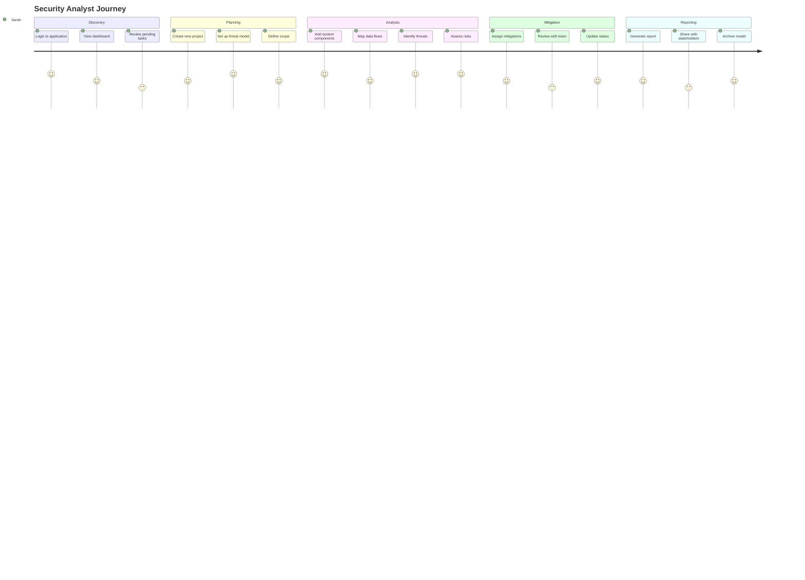
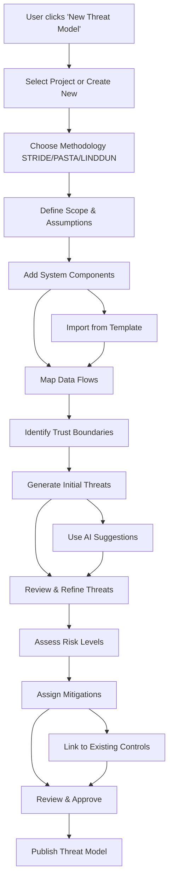
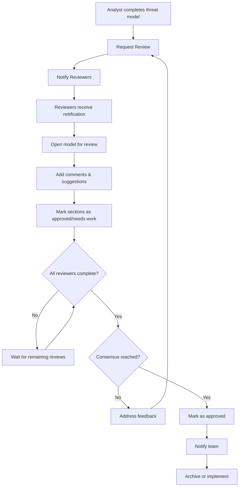
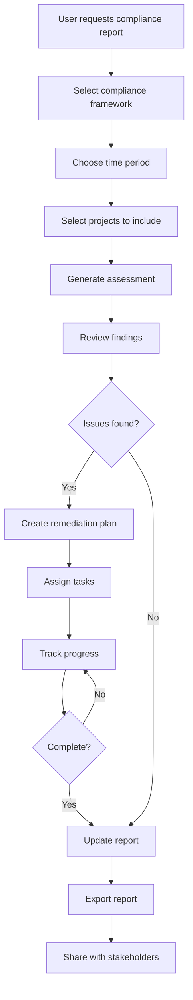

# UI/UX Design - Threat Modeling Application

## Overview

This document outlines the comprehensive UI/UX design for the Threat Modeling Application, including wireframes, user workflows, component library, design system, and accessibility guidelines. The design focuses on security professionals, developers, and stakeholders who need to create, manage, and collaborate on threat models.

## User Research and Personas

### Primary Personas

#### 1. Security Analyst (Sarah)
- **Role**: Senior Security Analyst
- **Experience**: 8+ years in cybersecurity
- **Goals**: 
  - Efficiently identify and assess threats
  - Create comprehensive threat models
  - Generate compliance reports
- **Pain Points**:
  - Complex tools with steep learning curves
  - Time-consuming manual processes
  - Difficulty in collaboration
- **Technical Skills**: High
- **Tool Usage**: 8+ hours/day

#### 2. Product Manager (Mike)
- **Role**: Senior Product Manager
- **Experience**: 5 years in product management
- **Goals**:
  - Understand security risks for product decisions
  - Track threat mitigation progress
  - Communicate risks to stakeholders
- **Pain Points**:
  - Technical security jargon
  - Lack of business context in reports
  - Difficulty prioritizing security work
- **Technical Skills**: Medium
- **Tool Usage**: 2-3 hours/week

#### 3. Developer (Alex)
- **Role**: Full-stack Developer
- **Experience**: 4 years in software development
- **Goals**:
  - Understand security requirements
  - Implement security controls
  - Review threat models for features
- **Pain Points**:
  - Security requirements unclear
  - Disconnected from security process
  - Lack of actionable guidance
- **Technical Skills**: High (Development), Low (Security)
- **Tool Usage**: 1-2 hours/week

#### 4. CISO (David)
- **Role**: Chief Information Security Officer
- **Experience**: 15+ years in cybersecurity leadership
- **Goals**:
  - Oversight of security posture
  - Compliance reporting
  - Strategic security planning
- **Pain Points**:
  - Lack of visibility into security activities
  - Manual reporting processes
  - Difficulty demonstrating ROI
- **Technical Skills**: High
- **Tool Usage**: 30 minutes/day

### User Journey Analysis



## Information Architecture

### Site Map

```
Application Root
├── Authentication
│   ├── Login
│   ├── Register
│   ├── Password Reset
│   └── MFA Setup
├── Dashboard
│   ├── Overview
│   ├── Recent Activity
│   ├── Notifications
│   └── Quick Actions
├── Projects
│   ├── Project List
│   ├── Project Detail
│   ├── Create Project
│   └── Project Settings
├── Threat Models
│   ├── Model List
│   ├── Model Canvas
│   ├── Threat Library
│   ├── Components & Data Flows
│   ├── Threat Analysis
│   ├── Risk Assessment
│   └── Mitigations
├── Reports
│   ├── Report Gallery
│   ├── Report Builder
│   ├── Scheduled Reports
│   └── Export Center
├── Collaboration
│   ├── Team Management
│   ├── Comments & Reviews
│   ├── Real-time Editing
│   └── Notifications
├── Compliance
│   ├── Framework Library
│   ├── Assessment Templates
│   ├── Gap Analysis
│   └── Audit Reports
├── Analytics
│   ├── Security Metrics
│   ├── Performance Dashboard
│   ├── Trend Analysis
│   └── Custom Reports
├── Integrations
│   ├── Tool Connections
│   ├── API Management
│   ├── Data Import/Export
│   └── Webhook Configuration
├── Administration
│   ├── User Management
│   ├── Role & Permissions
│   ├── Organization Settings
│   ├── Security Settings
│   └── System Configuration
└── Help & Support
    ├── Documentation
    ├── Video Tutorials
    ├── Knowledge Base
    └── Contact Support
```

## Wireframes

### 1. Dashboard

```
┌─────────────────────────────────────────────────────────────────┐
│ [🏠] Threat Modeling Platform    [🔔] [👤 Sarah] [⚙️] [❓]     │
├─────────────────────────────────────────────────────────────────┤
│                                                                 │
│ Welcome back, Sarah!                      Last login: 2 hrs ago │
│                                                                 │
│ ┌───────────────┐ ┌───────────────┐ ┌───────────────┐         │
│ │   📊 Stats    │ │  ⚠️  Risks    │ │  ✅ Progress  │         │
│ │               │ │               │ │               │         │
│ │ 23 Active     │ │ 7 Critical    │ │ 89% Complete  │         │
│ │ Models        │ │ Threats       │ │ This Quarter  │         │
│ └───────────────┘ └───────────────┘ └───────────────┘         │
│                                                                 │
│ ┌─ Recent Activity ─────────────────┐ ┌─ Quick Actions ────────┐ │
│ │ • Model "Web App v2" updated     │ │ [+ New Project]       │ │
│ │ • 3 threats identified in API    │ │ [+ New Model]         │ │
│ │ • Compliance report generated    │ │ [📊 View Reports]      │ │
│ │ • Review requested by Mike       │ │ [🔍 Browse Library]    │ │
│ └────────────────────────────────────┘ └─────────────────────────┘ │
│                                                                 │
│ ┌─ My Tasks ─────────────────────────────────────────────────────┐ │
│ │ 🔴 High Priority                                              │ │
│ │ • Review API threat model (Due: Today)                       │ │
│ │ • Complete mobile app assessment (Due: Tomorrow)             │ │
│ │                                                               │ │
│ │ 🟡 Medium Priority                                            │ │
│ │ • Update compliance documentation                             │ │
│ │ • Validate mitigation controls                                │ │
│ └─────────────────────────────────────────────────────────────────┘ │
│                                                                 │
│ ┌─ Team Activity ───────────────────┐ ┌─ System Health ────────┐ │
│ │ • Alex added threat T-001        │ │ ✅ All systems normal  │ │
│ │ • Mike approved model v1.2       │ │ 📈 99.9% uptime       │ │
│ │ • 3 team members online         │ │ 🔄 Last backup: 1h ago │ │
│ └────────────────────────────────────┘ └─────────────────────────┘ │
└─────────────────────────────────────────────────────────────────┘
```

### 2. Threat Model Canvas

```
┌─────────────────────────────────────────────────────────────────┐
│ [🏠] E-commerce Platform Threat Model v1.3              [💾] [⚙️] │
├─┬─┬─┬─┬─┬─┬─┬─┬─┬─┬─┬─┬─┬─┬─┬─┬─┬─┬─┬─┬─┬─┬─┬─┬─┬─┬─┬─┬─┬─┬─┤
│ │ │ │ │ │ │Components│ │ │ │ │ │ Data Flows │ │ │ │ │Threats│ │
├─┴─┴─┴─┴─┴─┴─┴─┴─┴─┴─┴─┴─┴─┴─┴─┴─┴─┴─┴─┴─┴─┴─┴─┴─┴─┴─┴─┴─┴─┴─┤
│                                                                 │
│ ┌─ System Components ─────────────────────────────────────────┐  │
│ │                                                             │  │
│ │  👤              📱              ☁️              🏛️         │  │
│ │  User           Mobile          Web App         Database     │  │
│ │                  App                                        │  │
│ │                                                             │  │
│ │         ─────────────────→  ─────────────────→              │  │
│ │         HTTPS/TLS           API Calls                       │  │
│ │                                                             │  │
│ │                                      ↕                     │  │
│ │                                   SQL/TLS                   │  │
│ │                                                             │  │
│ │  🔧              🔒              📊              ☁️         │  │
│ │  Admin          Auth            Analytics       Cloud       │  │
│ │  Panel          Service         Service         Storage     │  │
│ │                                                             │  │
│ └─────────────────────────────────────────────────────────────┘  │
│                                                                 │
│ ┌─ Identified Threats ─────────────────────────────────────────┐ │
│ │ 🔴 T-001: SQL Injection in user registration                │ │
│ │ 🟡 T-002: Weak session management                           │ │
│ │ 🔴 T-003: Insufficient access controls                      │ │
│ │ 🟡 T-004: Data exposure in logs                             │ │
│ │ 🟢 T-005: CSRF in payment form (MITIGATED)                  │ │
│ │                                            [+ Add Threat]   │ │
│ └─────────────────────────────────────────────────────────────┘ │
│                                                                 │
│ ┌─ Risk Assessment ────────────┐ ┌─ Mitigation Status ────────┐ │
│ │ Critical: 2                  │ │ Complete: 5                │ │
│ │ High:     3                  │ │ In Progress: 3             │ │
│ │ Medium:   7                  │ │ Planned: 4                 │ │
│ │ Low:      2                  │ │ Not Started: 2             │ │
│ │                              │ │                            │ │
│ │ Overall Risk: 🔴 HIGH        │ │ Overall Progress: 67%      │ │
│ └──────────────────────────────┘ └────────────────────────────┘ │
└─────────────────────────────────────────────────────────────────┘
```

### 3. Project List

```
┌─────────────────────────────────────────────────────────────────┐
│ Projects                                     [🔍] [📊] [+ New]  │
├─────────────────────────────────────────────────────────────────┤
│                                                                 │
│ ┌─ Filters ─────────────────┐                                   │
│ │ Status: [All ▼]           │                                   │
│ │ Risk: [All ▼]             │                                   │
│ │ Owner: [All ▼]            │                                   │
│ │ Framework: [All ▼]        │                                   │
│ └───────────────────────────┘                                   │
│                                                                 │
│ ┌─────────────────────────────────────────────────────────────┐ │
│ │ 🔴 E-commerce Platform                         Active       │ │
│ │    Web Application • STRIDE • 14 threats found             │ │
│ │    Owner: Sarah • Updated: 2 hours ago                     │ │
│ │    [📝 Edit] [📊 Report] [👥 Share]                         │ │
│ ├─────────────────────────────────────────────────────────────┤ │
│ │ 🟡 Mobile Banking App                          In Review    │ │
│ │    Mobile Application • PASTA • 8 threats found            │ │
│ │    Owner: Mike • Updated: 1 day ago                        │ │
│ │    [📝 Edit] [📊 Report] [👥 Share]                         │ │
│ ├─────────────────────────────────────────────────────────────┤ │
│ │ 🟢 API Gateway                                Complete      │ │
│ │    Infrastructure • LINDDUN • 12 threats found             │ │
│ │    Owner: Alex • Updated: 3 days ago                       │ │
│ │    [📝 Edit] [📊 Report] [👥 Share]                         │ │
│ ├─────────────────────────────────────────────────────────────┤ │
│ │ 🔵 IoT Device Management                       Planning     │ │
│ │    IoT System • STRIDE • 0 threats found                   │ │
│ │    Owner: Sarah • Updated: 1 week ago                      │ │
│ │    [📝 Edit] [📊 Report] [👥 Share]                         │ │
│ └─────────────────────────────────────────────────────────────┘ │
│                                                                 │
│ Showing 4 of 23 projects                      [< 1 2 3 4 5 >] │
└─────────────────────────────────────────────────────────────────┘
```

### 4. Threat Detail Modal

```
┌─────────────────────────────────────────────────────────────────┐
│ Threat Details: T-001                                      [✕] │
├─────────────────────────────────────────────────────────────────┤
│                                                                 │
│ ┌─ Basic Information ─────────────────────────────────────────┐  │
│ │ Title: SQL Injection in User Registration                  │  │
│ │ ID: T-001                                                  │  │
│ │ Category: [Injection ▼]                                    │  │
│ │ STRIDE: [T] Tampering                                      │  │
│ │ Status: [In Analysis ▼]                                    │  │
│ └─────────────────────────────────────────────────────────────┘  │
│                                                                 │
│ ┌─ Description ───────────────────────────────────────────────┐ │
│ │ The user registration form does not properly validate      │ │
│ │ input, allowing attackers to inject malicious SQL code     │ │
│ │ that could compromise the database.                        │ │
│ │                                                            │ │
│ │ Attack Vector: Web form input fields                       │ │
│ │ Affected Component: User Registration Service              │ │
│ └─────────────────────────────────────────────────────────────┘ │
│                                                                 │
│ ┌─ Risk Assessment ──────────────┐ ┌─ CVSS Score ──────────────┐ │
│ │ Likelihood: [High ▼]          │ │ Base Score: 8.1           │ │
│ │ Impact: [High ▼]              │ │ [🔴] High                 │ │
│ │ Risk Score: 8.5/10            │ │                           │ │
│ │ Priority: 🔴 Critical         │ │ Vector: CVSS:3.1/AV:N/    │ │
│ └───────────────────────────────┘ └───────────────────────────┘ │
│                                                                 │
│ ┌─ Mitigations ──────────────────────────────────────────────┐  │
│ │ ✅ M-001: Input validation (Complete)                      │  │
│ │ 🟡 M-002: Parameterized queries (In Progress)             │  │
│ │ ⭕ M-003: Database permissions review (Planned)            │  │
│ │                                        [+ Add Mitigation]  │  │
│ └─────────────────────────────────────────────────────────────┘  │
│                                                                 │
│ ┌─ Comments ─────────────────────────────────────────────────┐   │
│ │ Sarah (2h ago): Initial assessment complete               │   │
│ │ Mike (1h ago): Business impact confirmed as high          │   │
│ │ Alex (30m ago): Technical review in progress              │   │
│ │ ┌──────────────────────────────────────────────────────┐  │   │
│ │ │ Add comment...                              [Post]   │  │   │
│ │ └──────────────────────────────────────────────────────┘  │   │
│ └─────────────────────────────────────────────────────────────┘   │
│                                                                 │
│ [💾 Save] [🗑️ Delete] [📤 Export] [📋 Copy Link]               │
└─────────────────────────────────────────────────────────────────┘
```

### 5. Report Builder

```
┌─────────────────────────────────────────────────────────────────┐
│ Report Builder                                     [💾] [📤]    │
├─────────────────────────────────────────────────────────────────┤
│                                                                 │
│ ┌─ Report Configuration ─────────────────────────────────────┐   │
│ │ Title: [Quarterly Security Assessment          ]           │   │
│ │ Type: [Executive Summary ▼]                                │   │
│ │ Format: [PDF ▼] [Word] [HTML]                              │   │
│ │ Template: [Corporate Template ▼]                           │   │
│ └─────────────────────────────────────────────────────────────┘   │
│                                                                 │
│ ┌─ Data Sources ─────────────────────────────────────────────┐   │
│ │ Projects:                                                  │   │
│ │ ☑️ E-commerce Platform                                      │   │
│ │ ☑️ Mobile Banking App                                       │   │
│ │ ☑️ API Gateway                                              │   │
│ │ ☐ IoT Device Management                                    │   │
│ │                                                            │   │
│ │ Date Range: [Last Quarter ▼]                               │   │
│ │ From: [2024-01-01] To: [2024-03-31]                        │   │
│ └─────────────────────────────────────────────────────────────┘   │
│                                                                 │
│ ┌─ Report Sections ──────────────────────────────────────────┐   │
│ │ ☑️ Executive Summary                                        │   │
│ │ ☑️ Risk Overview                                            │   │
│ │ ☑️ Threat Analysis                                          │   │
│ │ ☑️ Mitigation Status                                        │   │
│ │ ☑️ Compliance Assessment                                    │   │
│ │ ☐ Technical Details                                        │   │
│ │ ☑️ Recommendations                                          │   │
│ │ ☐ Appendices                                               │   │
│ └─────────────────────────────────────────────────────────────┘   │
│                                                                 │
│ ┌─ Preview ──────────────────────────────────────────────────┐   │
│ │ ┌────────────────────────────────────────────────────────┐ │   │
│ │ │ Quarterly Security Assessment                          │ │   │
│ │ │                                                        │ │   │
│ │ │ Executive Summary                                      │ │   │
│ │ │ This report provides an overview of the security      │ │   │
│ │ │ posture for Q1 2024, covering 3 major projects...     │ │   │
│ │ │                                                        │ │   │
│ │ │ Risk Overview                                          │ │   │
│ │ │ • Critical Risks: 2                                   │ │   │
│ │ │ • High Risks: 8                                       │ │   │
│ │ │ • Medium Risks: 15                                    │ │   │
│ │ └────────────────────────────────────────────────────────┘ │   │
│ └─────────────────────────────────────────────────────────────┘   │
│                                                                 │
│ [🔄 Refresh Preview] [⬇️ Generate Report]                       │
└─────────────────────────────────────────────────────────────────┘
```

## User Workflows

### 1. Create New Threat Model Workflow



### 2. Collaborative Review Workflow



### 3. Compliance Reporting Workflow



## Component Library

### Design Tokens

```typescript
// design-tokens.ts
export const tokens = {
  colors: {
    // Primary palette
    primary: {
      50: '#f0f9ff',
      100: '#e0f2fe',
      200: '#bae6fd',
      300: '#7dd3fc',
      400: '#38bdf8',
      500: '#0ea5e9',  // Main brand color
      600: '#0284c7',
      700: '#0369a1',
      800: '#075985',
      900: '#0c4a6e',
    },
    
    // Security status colors
    severity: {
      critical: '#dc2626',  // Red 600
      high: '#ea580c',      // Orange 600
      medium: '#d97706',    // Amber 600
      low: '#65a30d',       // Lime 600
      info: '#2563eb',      // Blue 600
    },
    
    // Status colors
    status: {
      success: '#16a34a',   // Green 600
      warning: '#d97706',   // Amber 600
      error: '#dc2626',     // Red 600
      info: '#2563eb',      // Blue 600
    },
    
    // Neutral colors
    gray: {
      50: '#f9fafb',
      100: '#f3f4f6',
      200: '#e5e7eb',
      300: '#d1d5db',
      400: '#9ca3af',
      500: '#6b7280',
      600: '#4b5563',
      700: '#374151',
      800: '#1f2937',
      900: '#111827',
    },
  },
  
  typography: {
    fontFamily: {
      sans: ['Inter', 'system-ui', 'sans-serif'],
      mono: ['JetBrains Mono', 'Menlo', 'monospace'],
    },
    fontSize: {
      xs: ['0.75rem', { lineHeight: '1rem' }],
      sm: ['0.875rem', { lineHeight: '1.25rem' }],
      base: ['1rem', { lineHeight: '1.5rem' }],
      lg: ['1.125rem', { lineHeight: '1.75rem' }],
      xl: ['1.25rem', { lineHeight: '1.75rem' }],
      '2xl': ['1.5rem', { lineHeight: '2rem' }],
      '3xl': ['1.875rem', { lineHeight: '2.25rem' }],
      '4xl': ['2.25rem', { lineHeight: '2.5rem' }],
    },
    fontWeight: {
      normal: '400',
      medium: '500',
      semibold: '600',
      bold: '700',
    },
  },
  
  spacing: {
    0: '0px',
    1: '0.25rem',
    2: '0.5rem',
    3: '0.75rem',
    4: '1rem',
    5: '1.25rem',
    6: '1.5rem',
    8: '2rem',
    10: '2.5rem',
    12: '3rem',
    16: '4rem',
    20: '5rem',
    24: '6rem',
  },
  
  borderRadius: {
    none: '0',
    sm: '0.125rem',
    base: '0.25rem',
    md: '0.375rem',
    lg: '0.5rem',
    xl: '0.75rem',
    '2xl': '1rem',
    full: '9999px',
  },
  
  shadows: {
    sm: '0 1px 2px 0 rgb(0 0 0 / 0.05)',
    base: '0 1px 3px 0 rgb(0 0 0 / 0.1), 0 1px 2px -1px rgb(0 0 0 / 0.1)',
    md: '0 4px 6px -1px rgb(0 0 0 / 0.1), 0 2px 4px -2px rgb(0 0 0 / 0.1)',
    lg: '0 10px 15px -3px rgb(0 0 0 / 0.1), 0 4px 6px -4px rgb(0 0 0 / 0.1)',
    xl: '0 20px 25px -5px rgb(0 0 0 / 0.1), 0 8px 10px -6px rgb(0 0 0 / 0.1)',
  },
};
```

### Core Components

#### Button Component

```typescript
// components/Button.tsx
import React from 'react';
import { cva, type VariantProps } from 'class-variance-authority';
import { cn } from '@/lib/utils';

const buttonVariants = cva(
  'inline-flex items-center justify-center rounded-md text-sm font-medium transition-colors focus-visible:outline-none focus-visible:ring-2 focus-visible:ring-ring focus-visible:ring-offset-2 disabled:opacity-50 disabled:pointer-events-none ring-offset-background',
  {
    variants: {
      variant: {
        default: 'bg-primary text-primary-foreground hover:bg-primary/90',
        destructive: 'bg-destructive text-destructive-foreground hover:bg-destructive/90',
        outline: 'border border-input hover:bg-accent hover:text-accent-foreground',
        secondary: 'bg-secondary text-secondary-foreground hover:bg-secondary/80',
        ghost: 'hover:bg-accent hover:text-accent-foreground',
        link: 'underline-offset-4 hover:underline text-primary',
      },
      size: {
        default: 'h-10 py-2 px-4',
        sm: 'h-9 px-3 rounded-md',
        lg: 'h-11 px-8 rounded-md',
        icon: 'h-10 w-10',
      },
    },
    defaultVariants: {
      variant: 'default',
      size: 'default',
    },
  }
);

export interface ButtonProps
  extends React.ButtonHTMLAttributes<HTMLButtonElement>,
    VariantProps<typeof buttonVariants> {
  asChild?: boolean;
}

const Button = React.forwardRef<HTMLButtonElement, ButtonProps>(
  ({ className, variant, size, asChild = false, ...props }, ref) => {
    const Comp = asChild ? 'span' : 'button';
    return (
      <Comp
        className={cn(buttonVariants({ variant, size, className }))}
        ref={ref}
        {...props}
      />
    );
  }
);

Button.displayName = 'Button';

export { Button, buttonVariants };
```

#### Threat Card Component

```typescript
// components/ThreatCard.tsx
import React from 'react';
import { Card, CardHeader, CardContent } from './Card';
import { Badge } from './Badge';
import { Button } from './Button';
import { cn } from '@/lib/utils';

interface ThreatCardProps {
  threat: {
    id: string;
    title: string;
    category: string;
    severity: 'critical' | 'high' | 'medium' | 'low';
    status: 'identified' | 'analyzing' | 'mitigated' | 'accepted';
    description: string;
    riskScore: number;
    mitigations: number;
    lastUpdated: string;
  };
  onView?: () => void;
  onEdit?: () => void;
  className?: string;
}

const severityColors = {
  critical: 'bg-red-500 text-white',
  high: 'bg-orange-500 text-white',
  medium: 'bg-yellow-500 text-black',
  low: 'bg-green-500 text-white',
};

const statusColors = {
  identified: 'bg-blue-100 text-blue-800',
  analyzing: 'bg-yellow-100 text-yellow-800',
  mitigated: 'bg-green-100 text-green-800',
  accepted: 'bg-gray-100 text-gray-800',
};

export const ThreatCard: React.FC<ThreatCardProps> = ({
  threat,
  onView,
  onEdit,
  className,
}) => {
  return (
    <Card className={cn('hover:shadow-md transition-shadow', className)}>
      <CardHeader className="pb-3">
        <div className="flex items-start justify-between">
          <div className="space-y-1">
            <h3 className="font-semibold text-lg">{threat.title}</h3>
            <p className="text-sm text-gray-600">{threat.id}</p>
          </div>
          <div className="flex gap-2">
            <Badge
              className={severityColors[threat.severity]}
              variant="secondary"
            >
              {threat.severity.toUpperCase()}
            </Badge>
            <Badge
              className={statusColors[threat.status]}
              variant="outline"
            >
              {threat.status.toUpperCase()}
            </Badge>
          </div>
        </div>
      </CardHeader>
      <CardContent className="space-y-4">
        <p className="text-sm text-gray-700 line-clamp-2">
          {threat.description}
        </p>
        
        <div className="flex items-center justify-between text-sm">
          <div className="space-y-1">
            <div className="flex items-center gap-2">
              <span className="text-gray-500">Risk Score:</span>
              <span className="font-medium">{threat.riskScore}/10</span>
            </div>
            <div className="flex items-center gap-2">
              <span className="text-gray-500">Mitigations:</span>
              <span className="font-medium">{threat.mitigations}</span>
            </div>
          </div>
          <div className="text-right">
            <p className="text-gray-500">Updated</p>
            <p className="font-medium">{threat.lastUpdated}</p>
          </div>
        </div>
        
        <div className="flex gap-2 pt-2">
          <Button
            variant="outline"
            size="sm"
            onClick={onView}
            className="flex-1"
          >
            View Details
          </Button>
          <Button
            variant="default"
            size="sm"
            onClick={onEdit}
            className="flex-1"
          >
            Edit
          </Button>
        </div>
      </CardContent>
    </Card>
  );
};
```

#### Risk Assessment Component

```typescript
// components/RiskAssessment.tsx
import React from 'react';
import { cn } from '@/lib/utils';

interface RiskAssessmentProps {
  likelihood: 1 | 2 | 3 | 4 | 5;
  impact: 1 | 2 | 3 | 4 | 5;
  onLikelihoodChange?: (value: 1 | 2 | 3 | 4 | 5) => void;
  onImpactChange?: (value: 1 | 2 | 3 | 4 | 5) => void;
  readonly?: boolean;
  className?: string;
}

const getRiskScore = (likelihood: number, impact: number): number => {
  return likelihood * impact;
};

const getRiskLevel = (score: number): {
  level: string;
  color: string;
  bgColor: string;
} => {
  if (score <= 4) return { level: 'Low', color: 'text-green-700', bgColor: 'bg-green-100' };
  if (score <= 9) return { level: 'Medium', color: 'text-yellow-700', bgColor: 'bg-yellow-100' };
  if (score <= 16) return { level: 'High', color: 'text-orange-700', bgColor: 'bg-orange-100' };
  return { level: 'Critical', color: 'text-red-700', bgColor: 'bg-red-100' };
};

const RatingButton: React.FC<{
  value: number;
  selected: boolean;
  onClick?: () => void;
  readonly?: boolean;
}> = ({ value, selected, onClick, readonly }) => (
  <button
    type="button"
    disabled={readonly}
    onClick={onClick}
    className={cn(
      'w-8 h-8 rounded-full border-2 text-sm font-medium transition-colors',
      selected
        ? 'bg-primary border-primary text-white'
        : 'bg-white border-gray-300 text-gray-700 hover:border-primary',
      readonly && 'cursor-default opacity-60'
    )}
  >
    {value}
  </button>
);

export const RiskAssessment: React.FC<RiskAssessmentProps> = ({
  likelihood,
  impact,
  onLikelihoodChange,
  onImpactChange,
  readonly = false,
  className,
}) => {
  const riskScore = getRiskScore(likelihood, impact);
  const riskLevel = getRiskLevel(riskScore);

  return (
    <div className={cn('space-y-6', className)}>
      {/* Likelihood Assessment */}
      <div className="space-y-3">
        <label className="text-sm font-medium text-gray-700">
          Likelihood
        </label>
        <div className="flex items-center gap-2">
          {[1, 2, 3, 4, 5].map((value) => (
            <RatingButton
              key={value}
              value={value}
              selected={likelihood === value}
              onClick={() => onLikelihoodChange?.(value as 1 | 2 | 3 | 4 | 5)}
              readonly={readonly}
            />
          ))}
        </div>
        <div className="text-xs text-gray-500">
          1 = Very Low, 2 = Low, 3 = Medium, 4 = High, 5 = Very High
        </div>
      </div>

      {/* Impact Assessment */}
      <div className="space-y-3">
        <label className="text-sm font-medium text-gray-700">
          Impact
        </label>
        <div className="flex items-center gap-2">
          {[1, 2, 3, 4, 5].map((value) => (
            <RatingButton
              key={value}
              value={value}
              selected={impact === value}
              onClick={() => onImpactChange?.(value as 1 | 2 | 3 | 4 | 5)}
              readonly={readonly}
            />
          ))}
        </div>
        <div className="text-xs text-gray-500">
          1 = Very Low, 2 = Low, 3 = Medium, 4 = High, 5 = Very High
        </div>
      </div>

      {/* Risk Score Display */}
      <div className="p-4 bg-gray-50 rounded-lg">
        <div className="flex items-center justify-between">
          <div>
            <p className="text-sm font-medium text-gray-700">Risk Score</p>
            <p className="text-2xl font-bold text-gray-900">{riskScore}</p>
          </div>
          <div
            className={cn(
              'px-3 py-1 rounded-full text-sm font-medium',
              riskLevel.color,
              riskLevel.bgColor
            )}
          >
            {riskLevel.level}
          </div>
        </div>
        <div className="mt-2 text-xs text-gray-500">
          Calculation: Likelihood ({likelihood}) × Impact ({impact}) = {riskScore}
        </div>
      </div>
    </div>
  );
};
```

## Design System Documentation

### Typography Scale

```css
/* Typography System */
.text-display-1 {
  font-size: 4rem;
  font-weight: 700;
  line-height: 1.1;
  letter-spacing: -0.02em;
}

.text-display-2 {
  font-size: 3rem;
  font-weight: 700;
  line-height: 1.2;
  letter-spacing: -0.02em;
}

.text-heading-1 {
  font-size: 2.25rem;
  font-weight: 600;
  line-height: 1.3;
  letter-spacing: -0.01em;
}

.text-heading-2 {
  font-size: 1.875rem;
  font-weight: 600;
  line-height: 1.3;
  letter-spacing: -0.01em;
}

.text-heading-3 {
  font-size: 1.5rem;
  font-weight: 600;
  line-height: 1.4;
}

.text-body-large {
  font-size: 1.125rem;
  font-weight: 400;
  line-height: 1.6;
}

.text-body {
  font-size: 1rem;
  font-weight: 400;
  line-height: 1.6;
}

.text-body-small {
  font-size: 0.875rem;
  font-weight: 400;
  line-height: 1.5;
}

.text-caption {
  font-size: 0.75rem;
  font-weight: 400;
  line-height: 1.4;
  letter-spacing: 0.01em;
}
```

### Spacing System

```css
/* Spacing System */
.space-unit {
  /* Base unit: 4px */
  --space-1: 0.25rem;  /* 4px */
  --space-2: 0.5rem;   /* 8px */
  --space-3: 0.75rem;  /* 12px */
  --space-4: 1rem;     /* 16px */
  --space-5: 1.25rem;  /* 20px */
  --space-6: 1.5rem;   /* 24px */
  --space-8: 2rem;     /* 32px */
  --space-10: 2.5rem;  /* 40px */
  --space-12: 3rem;    /* 48px */
  --space-16: 4rem;    /* 64px */
  --space-20: 5rem;    /* 80px */
  --space-24: 6rem;    /* 96px */
}

/* Component spacing */
.component-spacing {
  --spacing-component-xs: var(--space-2);
  --spacing-component-sm: var(--space-3);
  --spacing-component-md: var(--space-4);
  --spacing-component-lg: var(--space-6);
  --spacing-component-xl: var(--space-8);
}
```

### Color Guidelines

```css
/* Color System */
:root {
  /* Primary Colors */
  --color-primary-50: #f0f9ff;
  --color-primary-500: #0ea5e9;
  --color-primary-900: #0c4a6e;
  
  /* Semantic Colors */
  --color-success: #16a34a;
  --color-warning: #d97706;
  --color-error: #dc2626;
  --color-info: #2563eb;
  
  /* Security Severity Colors */
  --color-severity-critical: #dc2626;
  --color-severity-high: #ea580c;
  --color-severity-medium: #d97706;
  --color-severity-low: #65a30d;
  
  /* Neutral Colors */
  --color-gray-50: #f9fafb;
  --color-gray-100: #f3f4f6;
  --color-gray-500: #6b7280;
  --color-gray-900: #111827;
}

/* Usage Guidelines */
.color-usage {
  /* Text colors */
  color: var(--color-gray-900);     /* Primary text */
  color: var(--color-gray-500);     /* Secondary text */
  color: var(--color-primary-500);  /* Link/accent text */
  
  /* Background colors */
  background: var(--color-gray-50); /* Page background */
  background: white;                /* Card/container background */
  background: var(--color-primary-500); /* Primary action background */
}
```

## Accessibility Guidelines

### WCAG 2.1 AA Compliance

```typescript
// accessibility/guidelines.ts
export const accessibilityGuidelines = {
  colorContrast: {
    // Minimum contrast ratios
    normalText: 4.5, // AA standard
    largeText: 3.0,  // AA standard for 18pt+ or 14pt+ bold
    graphicalObjects: 3.0,
    
    // Implementation
    checkContrast: (foreground: string, background: string) => {
      // Implementation to check color contrast
      return calculateContrastRatio(foreground, background);
    },
  },
  
  keyboard: {
    // All interactive elements must be keyboard accessible
    tabOrder: 'logical',
    focusVisible: 'always',
    skipLinks: 'required',
    
    // Focus management
    trapFocus: 'modals and overlays',
    restoreFocus: 'after modal close',
  },
  
  screenReader: {
    // ARIA labels and descriptions
    images: 'alt text required',
    buttons: 'descriptive labels',
    forms: 'associated labels',
    landmarks: 'proper heading hierarchy',
    
    // Live regions for dynamic content
    alerts: 'aria-live=assertive',
    status: 'aria-live=polite',
  },
  
  motor: {
    // Touch targets
    minimumSize: '44px × 44px',
    spacing: '8px minimum between targets',
    
    // Interaction time
    timeout: 'extendable or no timeout',
    animations: 'respectsReducedMotion',
  },
};
```

### Keyboard Navigation

```typescript
// components/KeyboardNavigation.tsx
import React, { useEffect, useRef } from 'react';
import { useFocusTrap } from '@/hooks/useFocusTrap';

export const FocusableContainer: React.FC<{
  children: React.ReactNode;
  trapFocus?: boolean;
  restoreFocus?: boolean;
}> = ({ children, trapFocus = false, restoreFocus = false }) => {
  const containerRef = useRef<HTMLDivElement>(null);
  const previousActiveElement = useRef<HTMLElement | null>(null);

  useFocusTrap(containerRef, trapFocus);

  useEffect(() => {
    if (restoreFocus) {
      previousActiveElement.current = document.activeElement as HTMLElement;
      
      return () => {
        previousActiveElement.current?.focus();
      };
    }
  }, [restoreFocus]);

  return (
    <div
      ref={containerRef}
      role="region"
      tabIndex={-1}
      className="focus:outline-none"
    >
      {children}
    </div>
  );
};

// Skip link component
export const SkipLink: React.FC<{ href: string; children: React.ReactNode }> = ({
  href,
  children,
}) => (
  <a
    href={href}
    className="sr-only focus:not-sr-only focus:absolute focus:top-4 focus:left-4 bg-primary text-white px-4 py-2 rounded-md z-50"
  >
    {children}
  </a>
);
```

### Screen Reader Support

```typescript
// components/ScreenReaderSupport.tsx
import React from 'react';

// Live region for announcements
export const LiveRegion: React.FC<{
  message: string;
  priority?: 'polite' | 'assertive';
}> = ({ message, priority = 'polite' }) => (
  <div
    role="status"
    aria-live={priority}
    aria-atomic="true"
    className="sr-only"
  >
    {message}
  </div>
);

// Accessible threat card with proper ARIA labels
export const AccessibleThreatCard: React.FC<{
  threat: ThreatData;
}> = ({ threat }) => (
  <article
    role="article"
    aria-labelledby={`threat-title-${threat.id}`}
    aria-describedby={`threat-desc-${threat.id}`}
    className="threat-card"
  >
    <header>
      <h3 id={`threat-title-${threat.id}`}>
        {threat.title}
      </h3>
      <div role="group" aria-label="Threat metadata">
        <span
          className="severity-badge"
          aria-label={`Severity: ${threat.severity}`}
        >
          {threat.severity}
        </span>
        <span
          className="status-badge"
          aria-label={`Status: ${threat.status}`}
        >
          {threat.status}
        </span>
      </div>
    </header>
    
    <div id={`threat-desc-${threat.id}`}>
      {threat.description}
    </div>
    
    <footer>
      <button
        type="button"
        aria-label={`View details for threat ${threat.title}`}
      >
        View Details
      </button>
      <button
        type="button"
        aria-label={`Edit threat ${threat.title}`}
      >
        Edit
      </button>
    </footer>
  </article>
);
```

## Responsive Design

### Breakpoint System

```css
/* Responsive Breakpoints */
:root {
  --breakpoint-sm: 640px;   /* Small tablets */
  --breakpoint-md: 768px;   /* Large tablets */
  --breakpoint-lg: 1024px;  /* Small laptops */
  --breakpoint-xl: 1280px;  /* Large laptops */
  --breakpoint-2xl: 1536px; /* Desktop */
}

/* Mobile-first approach */
.responsive-grid {
  display: grid;
  grid-template-columns: 1fr;
  gap: 1rem;
  
  /* Tablet and up */
  @media (min-width: 768px) {
    grid-template-columns: repeat(2, 1fr);
    gap: 1.5rem;
  }
  
  /* Desktop and up */
  @media (min-width: 1024px) {
    grid-template-columns: repeat(3, 1fr);
    gap: 2rem;
  }
}

/* Container system */
.container {
  width: 100%;
  margin: 0 auto;
  padding: 0 1rem;
  
  @media (min-width: 640px) {
    max-width: 640px;
  }
  
  @media (min-width: 768px) {
    max-width: 768px;
    padding: 0 1.5rem;
  }
  
  @media (min-width: 1024px) {
    max-width: 1024px;
    padding: 0 2rem;
  }
  
  @media (min-width: 1280px) {
    max-width: 1280px;
  }
}
```

### Mobile Layout Adaptations

```typescript
// components/ResponsiveLayout.tsx
import React from 'react';
import { useMediaQuery } from '@/hooks/useMediaQuery';

export const ResponsiveThreatModel: React.FC = () => {
  const isMobile = useMediaQuery('(max-width: 768px)');
  const isTablet = useMediaQuery('(min-width: 769px) and (max-width: 1024px)');

  if (isMobile) {
    return (
      <div className="mobile-layout">
        {/* Stacked layout for mobile */}
        <ThreatModelHeader />
        <ThreatModelTabs />
        <ThreatModelContent />
      </div>
    );
  }

  if (isTablet) {
    return (
      <div className="tablet-layout grid grid-cols-2 gap-4">
        {/* Two-column layout for tablets */}
        <div className="col-span-2">
          <ThreatModelHeader />
        </div>
        <ThreatModelSidebar />
        <ThreatModelCanvas />
      </div>
    );
  }

  return (
    <div className="desktop-layout grid grid-cols-4 gap-6">
      {/* Full desktop layout */}
      <div className="col-span-4">
        <ThreatModelHeader />
      </div>
      <ThreatModelSidebar />
      <div className="col-span-2">
        <ThreatModelCanvas />
      </div>
      <ThreatModelDetails />
    </div>
  );
};
```

## Design System Implementation

### CSS Custom Properties

```css
/* CSS Custom Properties for Design System */
:root {
  /* Design tokens */
  --primary-50: #f0f9ff;
  --primary-500: #0ea5e9;
  --primary-900: #0c4a6e;
  
  /* Component tokens */
  --button-height: 2.5rem;
  --button-padding-x: 1rem;
  --button-border-radius: 0.375rem;
  --button-font-weight: 500;
  
  --card-padding: 1.5rem;
  --card-border-radius: 0.5rem;
  --card-shadow: 0 1px 3px 0 rgb(0 0 0 / 0.1);
  
  /* Animation tokens */
  --transition-fast: 150ms ease;
  --transition-normal: 200ms ease;
  --transition-slow: 300ms ease;
  
  /* Z-index scale */
  --z-dropdown: 1000;
  --z-sticky: 1020;
  --z-fixed: 1030;
  --z-modal-backdrop: 1040;
  --z-modal: 1050;
  --z-popover: 1060;
  --z-tooltip: 1070;
  --z-toast: 1080;
}

/* Component implementations */
.btn {
  height: var(--button-height);
  padding: 0 var(--button-padding-x);
  border-radius: var(--button-border-radius);
  font-weight: var(--button-font-weight);
  transition: var(--transition-fast);
}

.card {
  padding: var(--card-padding);
  border-radius: var(--card-border-radius);
  box-shadow: var(--card-shadow);
}
```

This comprehensive UI/UX design provides a complete foundation for building an intuitive, accessible, and scalable threat modeling application. The design system ensures consistency across all components while maintaining flexibility for future enhancements.