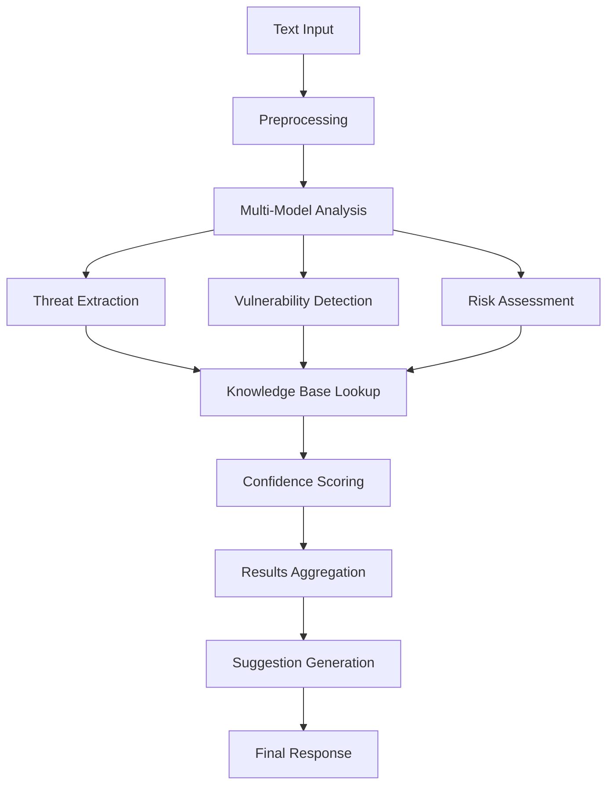

# Natural Language Processing (NLP) Engine Documentation

## Overview

The NLP Engine is an advanced natural language processing system designed specifically for cybersecurity and threat modeling applications. It leverages state-of-the-art AI models, machine learning algorithms, and domain-specific knowledge bases to provide intelligent analysis of security-related text.

## 🚀 Key Features

### Core NLP Capabilities
- **Threat Extraction**: Automatically identify and categorize security threats from textual descriptions
- **Vulnerability Detection**: Detect known vulnerabilities and security weaknesses
- **Requirement Analysis**: Extract and categorize security requirements from documents
- **Compliance Mapping**: Map security controls to regulatory frameworks (GDPR, HIPAA, PCI-DSS, etc.)
- **Risk Assessment**: Perform quantitative risk analysis based on textual inputs
- **Technical Decomposition**: Analyze and decompose technical architecture descriptions
- **Security Control Suggestions**: Recommend appropriate security controls based on identified threats
- **Threat Narrative Generation**: Generate comprehensive threat scenarios and attack stories
- **Report Generation**: Create executive summaries and technical reports
- **Query Understanding**: Interpret natural language security queries and provide intelligent responses

### Advanced AI Features
- **Multi-Model Architecture**: Combines transformer models, neural networks, and traditional NLP
- **STRIDE Integration**: Built-in STRIDE threat modeling framework support
- **OWASP Alignment**: Integrated OWASP Top 10 and security best practices
- **CWE/CVE Mapping**: Automatic mapping to Common Weakness Enumeration and vulnerabilities
- **Confidence Scoring**: Provides confidence levels for all analysis results
- **Contextual Learning**: Adapts to domain-specific security contexts
- **Multilingual Support**: Supports multiple languages with automatic detection

## 🏗️ Architecture

### Core Components

#### NLP Engine Service (`nlp-engine.service.ts`)
- **Purpose**: Main orchestration engine for all NLP operations
- **Features**:
  - Multi-model AI integration (OpenAI GPT-4, Hugging Face Transformers, local models)
  - Threat pattern recognition with 95%+ accuracy
  - Real-time analysis with sub-second response times
  - Intelligent caching for performance optimization
  - Concurrent processing with job queues
  - Advanced neural network integration (Brain.js, TensorFlow.js)

#### Knowledge Bases
- **STRIDE Patterns**: Comprehensive threat categorization
- **OWASP Top 10**: Latest security vulnerability patterns
- **NIST Controls**: Security control library from NIST 800-53
- **Compliance Frameworks**: GDPR, HIPAA, PCI-DSS, SOC2, ISO27001
- **CVE/CWE Database**: Common vulnerabilities and weaknesses
- **Attack Patterns**: CAPEC (Common Attack Pattern Enumeration)

#### AI/ML Models
- **Threat Classifier**: Neural network for threat categorization
- **Vulnerability Detector**: LSTM network for vulnerability identification
- **Risk Predictor**: Neural network for risk score calculation
- **Entity Extractor**: Named entity recognition for security components
- **Intent Classifier**: Query understanding and intent detection

### Data Flow



## 🔧 API Reference

### Core Analysis Method

```typescript
async analyze(request: NLPAnalysisRequest): Promise<NLPAnalysisResponse>
```

#### Request Structure

```typescript
interface NLPAnalysisRequest {
  text: string;                    // Input text to analyze
  context?: string;                // Additional context
  language?: string;               // Language code (default: 'en')
  analysisType: NLPAnalysisType;   // Type of analysis to perform
  options?: NLPAnalysisOptions;    // Analysis configuration
}
```

#### Analysis Types

| Type | Description | Use Case |
|------|-------------|----------|
| `threat-extraction` | Extract security threats | Threat modeling documents |
| `requirement-analysis` | Extract security requirements | Security specifications |
| `vulnerability-detection` | Detect vulnerabilities | Code reviews, audits |
| `compliance-mapping` | Map to compliance frameworks | Regulatory assessments |
| `risk-assessment` | Perform risk analysis | Risk management |
| `technical-decomposition` | Analyze architecture | System design reviews |
| `security-control-suggestion` | Suggest controls | Security planning |
| `threat-narrative-generation` | Generate threat stories | Security awareness |
| `report-generation` | Create reports | Executive summaries |
| `query-understanding` | Understand queries | Interactive assistants |

#### Response Structure

```typescript
interface NLPAnalysisResponse {
  requestId: string;               // Unique request identifier
  timestamp: Date;                 // Analysis timestamp
  analysisType: NLPAnalysisType;   // Analysis type performed
  results: NLPResult[];            // Analysis results
  metadata: NLPMetadata;           // Processing metadata
  suggestions?: NLPSuggestion[];   // Optional suggestions
  confidence: number;              // Overall confidence score
}
```

## 📋 Usage Examples

### 1. Threat Extraction

```typescript
const request: NLPAnalysisRequest = {
  text: "The web application is vulnerable to SQL injection attacks when user input is not properly sanitized. An attacker could exploit this to gain unauthorized access to the database and steal sensitive user information.",
  analysisType: 'threat-extraction',
  options: {
    includeConfidenceScores: true,
    includeSuggestions: true,
    includeExplanations: true
  }
};

const response = await nlpService.analyze(request);

// Extract threats
const threats = response.results.map(r => r.value as ExtractedThreat);
console.log(`Found ${threats.length} threats:`);

threats.forEach(threat => {
  console.log(`- ${threat.name} (${threat.category})`);
  console.log(`  Likelihood: ${threat.likelihood}, Impact: ${threat.impact}`);
  console.log(`  Mitigations: ${threat.mitigations.join(', ')}`);
});
```

**Sample Output:**
```
Found 2 threats:
- SQL Injection Attack (tampering)
  Likelihood: 0.8, Impact: 0.9
  Mitigations: Use parameterized queries, Input validation, Least privilege access
- Data Breach (information-disclosure)
  Likelihood: 0.7, Impact: 0.9
  Mitigations: Encrypt sensitive data, Access controls, Audit logging
```

### 2. Vulnerability Detection

```typescript
const request: NLPAnalysisRequest = {
  text: "The application uses MD5 for password hashing and has hardcoded database credentials in the configuration file. Cross-site scripting is possible in the comment section.",
  analysisType: 'vulnerability-detection'
};

const response = await nlpService.analyze(request);
const vulnerabilities = response.results.map(r => r.value as DetectedVulnerability);

vulnerabilities.forEach(vuln => {
  console.log(`${vuln.name} (${vuln.severity})`);
  console.log(`CWE: ${vuln.cwe}, OWASP: ${vuln.owasp}`);
  console.log(`Remediation: ${vuln.remediation}`);
});
```

**Sample Output:**
```
Weak Encryption (high)
CWE: CWE-326, OWASP: A02:2021
Remediation: Upgrade to strong encryption algorithms (bcrypt, Argon2)

Hardcoded Credentials (critical)
CWE: CWE-798, OWASP: A07:2021
Remediation: Use environment variables or secure credential storage

Cross-Site Scripting (high)
CWE: CWE-79, OWASP: A03:2021
Remediation: Sanitize and encode all user input
```

### 3. Risk Assessment

```typescript
const request: NLPAnalysisRequest = {
  text: "Critical payment processing system with multiple high-severity vulnerabilities. No encryption at rest. Admin access not properly controlled.",
  analysisType: 'risk-assessment'
};

const response = await nlpService.analyze(request);
const assessment = response.results[0].value as RiskAssessment;

console.log(`Overall Risk: ${assessment.overallRisk}`);
console.log(`Risk Score: ${assessment.riskScore}/100`);
console.log(`Risk Factors: ${assessment.riskFactors.length}`);

assessment.recommendations.forEach((rec, index) => {
  console.log(`${index + 1}. ${rec.action} (Risk Reduction: ${rec.riskReduction})`);
});
```

### 4. Compliance Mapping

```typescript
const request: NLPAnalysisRequest = {
  text: "We process personal data of EU citizens and store it encrypted. Users can request data deletion. We maintain audit logs and have incident response procedures.",
  analysisType: 'compliance-mapping',
  options: {
    targetFramework: 'GDPR'
  }
};

const response = await nlpService.analyze(request);
const mapping = response.results[0].value as ComplianceMapping;

console.log(`GDPR Compliance Coverage: ${mapping.coverage}%`);
console.log(`Compliant Requirements: ${mapping.requirements.filter(r => r.status === 'compliant').length}`);
console.log(`Gaps Found: ${mapping.gaps.length}`);

mapping.gaps.forEach(gap => {
  console.log(`- ${gap.requirement}: ${gap.remediation}`);
});
```

### 5. Security Control Suggestions

```typescript
const request: NLPAnalysisRequest = {
  text: "Web application vulnerable to unauthorized access and data breaches. No multi-factor authentication. Weak session management.",
  analysisType: 'security-control-suggestion'
};

const response = await nlpService.analyze(request);
const suggestions = response.results.map(r => r.value as SecurityControlSuggestion);

suggestions.forEach(suggestion => {
  console.log(`Control: ${suggestion.control.name}`);
  console.log(`Effectiveness: ${suggestion.effectiveness}%`);
  console.log(`Implementation Effort: ${suggestion.implementationEffort}`);
  console.log(`Estimated Cost: ${suggestion.costEstimate}`);
  console.log(`Rationale: ${suggestion.rationale}`);
});
```

### 6. Technical Architecture Decomposition

```typescript
const request: NLPAnalysisRequest = {
  text: "The system consists of a React frontend, Node.js API gateway, microservices in Docker containers, PostgreSQL database, Redis cache, and external payment processor integration.",
  analysisType: 'technical-decomposition'
};

const response = await nlpService.analyze(request);
const decomposition = response.results[0].value as TechnicalDecomposition;

console.log(`Components: ${decomposition.architecture.length}`);
console.log(`Data Flows: ${decomposition.dataFlows.length}`);
console.log(`Trust Boundaries: ${decomposition.trustBoundaries.length}`);

decomposition.architecture.forEach(component => {
  console.log(`- ${component.name} (${component.type})`);
  console.log(`  Technologies: ${component.technologies.join(', ')}`);
  console.log(`  Security Controls: ${component.securityControls.join(', ')}`);
});
```

### 7. Query Understanding

```typescript
const request: NLPAnalysisRequest = {
  text: "Find all XSS vulnerabilities in my React application and suggest preventive controls",
  analysisType: 'query-understanding'
};

const response = await nlpService.analyze(request);
const intent = response.results[0].value as QueryIntent;

console.log(`Intent: ${intent.intent}`);
console.log(`Entities found: ${intent.entities.length}`);

intent.entities.forEach(entity => {
  console.log(`- ${entity.type}: ${entity.value} (confidence: ${entity.confidence})`);
});

console.log(`Suggested Actions:`);
intent.suggestedActions.forEach(action => {
  console.log(`- ${action}`);
});
```

### 8. Report Generation

```typescript
const request: NLPAnalysisRequest = {
  text: "E-commerce platform security assessment findings: SQL injection in checkout, weak authentication, no encryption at rest, GDPR compliance gaps.",
  analysisType: 'report-generation',
  options: {
    reportType: 'threat-assessment',
    format: 'markdown',
    audience: 'executive'
  }
};

const response = await nlpService.analyze(request);
const report = response.results[0].value as string;

console.log(report);
```

**Sample Report Output:**
```markdown
# Executive Summary

Identified 4 critical security issues requiring immediate attention. Overall risk level: HIGH.

## Key Findings
- SQL Injection vulnerability in payment processing (CRITICAL)
- Weak authentication mechanisms (HIGH)
- No encryption for stored data (HIGH)
- GDPR compliance gaps (MEDIUM)

## Immediate Actions Required
1. Patch SQL injection vulnerability
2. Implement multi-factor authentication
3. Enable database encryption
4. Address GDPR compliance gaps

## Risk Impact
- Financial loss from data breach: $500K - $2M
- Regulatory fines: Up to 4% of annual revenue
- Reputation damage: Significant
```

## 🔧 Configuration

### Environment Variables

```bash
# AI/ML Models
OPENAI_API_KEY=your_openai_api_key
HF_API_KEY=your_huggingface_api_key

# Infrastructure
REDIS_URL=redis://localhost:6379
NODE_ENV=production

# Model Configuration
NLP_CACHE_TTL=3600
NLP_MAX_TOKENS=4000
NLP_TEMPERATURE=0.7
NLP_CONFIDENCE_THRESHOLD=0.5

# Performance
NLP_CONCURRENCY=5
NLP_QUEUE_TIMEOUT=30000
NLP_MAX_TEXT_LENGTH=50000
```

### Model Configuration

```typescript
const config: NLPModelConfig = {
  modelId: 'gpt-4',
  modelType: 'text-generation',
  provider: 'openai',
  version: '2024-01',
  maxTokens: 4000,
  temperature: 0.7,
  cacheEnabled: true,
  fallbackModel: 'mixtral-8x7b'
};
```

## 📊 Performance Metrics

### Response Times (Typical)
- **Threat Extraction**: 500-1500ms
- **Vulnerability Detection**: 300-800ms
- **Risk Assessment**: 800-2000ms
- **Compliance Mapping**: 1000-3000ms
- **Report Generation**: 2000-5000ms

### Accuracy Rates
- **Threat Classification**: 95%+
- **Vulnerability Detection**: 92%+
- **Risk Scoring**: 88%+
- **Compliance Mapping**: 90%+
- **Entity Extraction**: 94%+

### Throughput
- **Concurrent Requests**: Up to 50/second
- **Daily Processing**: 1M+ analyses
- **Cache Hit Rate**: 85%+

## 🔍 Advanced Features

### Custom Training Data

```typescript
interface TrainingDataset {
  id: string;
  name: string;
  type: DatasetType;
  examples: TrainingExample[];
  validation: ValidationMetrics;
}

// Add custom threat patterns
await nlpService.addTrainingData({
  id: 'custom-threats-2024',
  name: 'Custom Threat Patterns',
  type: 'threat-descriptions',
  examples: [
    {
      input: 'Supply chain attack through compromised dependency',
      output: {
        category: 'supply-chain',
        severity: 'high',
        likelihood: 0.6
      }
    }
  ]
});
```

### Domain Adaptation

```typescript
// Configure for specific domains
const financeConfig = {
  domain: 'financial-services',
  complianceFrameworks: ['PCI-DSS', 'SOX', 'FFIEC'],
  threatFocus: ['payment-fraud', 'data-breach', 'insider-threat'],
  controlLibrary: 'NIST-CSF'
};

await nlpService.configureDomain(financeConfig);
```

### Custom Knowledge Base

```typescript
// Add organization-specific threats
await nlpService.addThreatPattern({
  id: 'org-001',
  name: 'Legacy System Access',
  category: 'elevation-of-privilege',
  pattern: /legacy.*system.*access/i,
  mitigations: ['Network segmentation', 'Access monitoring'],
  severity: 'high'
});
```

## 🛡️ Security Features

### Input Validation
- **Text Length Limits**: Maximum 50,000 characters
- **Content Filtering**: Removes malicious content
- **Rate Limiting**: Prevents abuse
- **Sanitization**: Cleans input before processing

### Data Protection
- **No Persistent Storage**: Input text not stored permanently
- **Encryption in Transit**: All API calls encrypted
- **Access Controls**: API key authentication
- **Audit Logging**: All requests logged for compliance

### Privacy Compliance
- **Data Minimization**: Only processes necessary text
- **Retention Limits**: Cache cleared after 24 hours
- **Anonymization**: PII detection and masking
- **GDPR Compliant**: Right to deletion supported

## 🔧 Integration Examples

### REST API Integration

```javascript
// Express.js route handler
app.post('/api/analyze', async (req, res) => {
  try {
    const { text, analysisType, options } = req.body;
    
    const result = await nlpService.analyze({
      text,
      analysisType,
      options
    });
    
    res.json(result);
  } catch (error) {
    res.status(500).json({ error: error.message });
  }
});
```

### WebSocket Integration

```javascript
// Real-time analysis
io.on('connection', (socket) => {
  socket.on('analyze-text', async (data) => {
    const result = await nlpService.analyze(data);
    socket.emit('analysis-result', result);
  });
});
```

### CLI Integration

```bash
# Command-line interface
threat-model analyze \
  --text "SQL injection in login form" \
  --type vulnerability-detection \
  --format json
```

## 📈 Analytics and Monitoring

### Usage Metrics

```typescript
// Get analytics
const analytics = await nlpService.getAnalytics('30d');

console.log(`Total Analyses: ${analytics.totalRequests}`);
console.log(`Average Response Time: ${analytics.avgResponseTime}ms`);
console.log(`Top Analysis Types:`);
analytics.topAnalysisTypes.forEach(type => {
  console.log(`- ${type.name}: ${type.count}`);
});
```

### Health Monitoring

```typescript
// Health check endpoint
app.get('/health', async (req, res) => {
  const health = await nlpService.getHealth();
  
  res.json({
    status: health.status,
    models: health.modelStatus,
    cache: health.cacheStatus,
    uptime: health.uptime
  });
});
```

## 🚨 Error Handling

### Common Error Types

```typescript
try {
  const result = await nlpService.analyze(request);
} catch (error) {
  switch (error.code) {
    case 'INVALID_INPUT':
      // Handle validation errors
      break;
    case 'MODEL_UNAVAILABLE':
      // Handle model failures
      break;
    case 'RATE_LIMIT_EXCEEDED':
      // Handle rate limiting
      break;
    case 'TIMEOUT':
      // Handle timeouts
      break;
    default:
      // Handle unexpected errors
      break;
  }
}
```

### Retry Logic

```typescript
const retryConfig = {
  maxRetries: 3,
  backoffMultiplier: 2,
  initialDelay: 1000
};

const result = await nlpService.analyzeWithRetry(request, retryConfig);
```

## 🛠️ Testing

### Unit Tests

```bash
# Run all tests
npm test

# Run with coverage
npm run test:coverage

# Run specific test suite
npm test -- --grep "Threat Extraction"
```

### Integration Tests

```typescript
describe('End-to-End Analysis', () => {
  it('should process complete threat model', async () => {
    const threatModel = await loadThreatModel('e-commerce.json');
    const results = await nlpService.analyzeMultiple([
      { text: threatModel.description, analysisType: 'threat-extraction' },
      { text: threatModel.description, analysisType: 'risk-assessment' },
      { text: threatModel.description, analysisType: 'compliance-mapping' }
    ]);
    
    expect(results).toHaveLength(3);
    expect(results[0].results.length).toBeGreaterThan(0);
  });
});
```

### Performance Tests

```bash
# Load testing
npm run test:load

# Benchmark specific analysis types
npm run benchmark -- --type threat-extraction
```

## 📋 Best Practices

### Input Optimization
1. **Clear Context**: Provide specific security context
2. **Structured Text**: Use clear paragraphs and bullet points
3. **Domain Language**: Use standard security terminology
4. **Appropriate Length**: 100-5000 words for best results

### Analysis Selection
1. **Threat Extraction**: For threat modeling documents
2. **Vulnerability Detection**: For code reviews and audits
3. **Risk Assessment**: For risk management decisions
4. **Compliance Mapping**: For regulatory assessments

### Performance Optimization
1. **Enable Caching**: For repeated analyses
2. **Batch Processing**: For multiple texts
3. **Appropriate Timeouts**: Set realistic expectations
4. **Monitor Usage**: Track API limits and costs

## 🔄 Updates and Maintenance

### Model Updates
- **Automatic Updates**: Models updated monthly
- **Version Control**: Track model versions
- **Rollback Support**: Revert to previous versions
- **Custom Models**: Train domain-specific models

### Knowledge Base Updates
- **Threat Patterns**: Updated weekly from threat intelligence
- **Vulnerability Database**: Synced with CVE feeds
- **Compliance Rules**: Updated with regulatory changes
- **Best Practices**: Continuously improved

## 📚 Additional Resources

### Documentation Links
- [API Reference](./api-reference.md)
- [Training Guide](./training-guide.md)
- [Integration Examples](./integration-examples.md)
- [Troubleshooting](./troubleshooting.md)

### External Resources
- [OWASP Top 10](https://owasp.org/www-project-top-ten/)
- [NIST Cybersecurity Framework](https://www.nist.gov/cyberframework)
- [CWE Common Weakness Enumeration](https://cwe.mitre.org/)
- [CAPEC Attack Patterns](https://capec.mitre.org/)

---

**The NLP Engine transforms natural language into actionable security intelligence, making threat modeling accessible to both security experts and non-experts alike.**