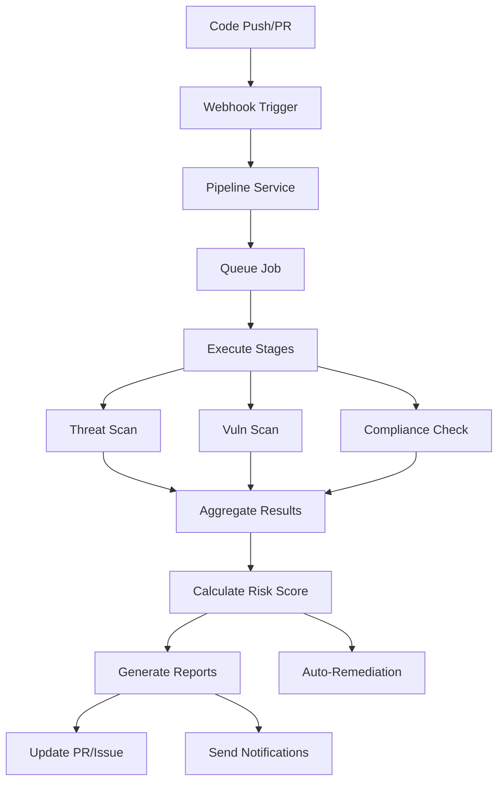

# DevOps CI/CD Pipeline Integration

## Overview

The DevOps CI/CD Pipeline Integration transforms the threat modeling platform into a continuous security solution that seamlessly integrates with existing development workflows. It provides automated security scanning, real-time feedback, and intelligent remediation capabilities across multiple CI/CD platforms.

## 🚀 Features

### Core Capabilities
- **Multi-Platform Support**: GitHub Actions, GitLab CI/CD, Jenkins, Azure DevOps, Bitbucket, CircleCI
- **Automated Security Scanning**: Threat detection, vulnerability scanning, compliance checking
- **Intelligent Pipeline Orchestration**: Stage-based execution with conditional logic
- **Real-Time Feedback**: Check runs, PR comments, issue creation
- **Auto-Remediation**: Automated fixes for common security issues
- **Comprehensive Reporting**: SARIF format, markdown reports, security dashboards
- **Webhook Integration**: Automated triggers based on repository events
- **Metrics & Analytics**: Success rates, finding trends, MTTR tracking

### Advanced Features
- **Smart Failure Handling**: Configurable failure actions (fail, warn, continue)
- **Parallel Execution**: Concurrent stage execution for faster scans
- **Result Caching**: Improved performance with intelligent caching
- **Custom Scripts**: Extensible with custom security checks
- **Notification System**: Multi-channel alerts (email, Slack, Teams, webhooks)
- **Security Gates**: Pre-commit, pre-merge, and pre-deploy checks
- **Finding Prioritization**: Risk-based scoring and recommendations

## 🏗️ Architecture

### Components

#### DevOps Service (`/backend/services/devops/src/services/devops.service.ts`)
- **Purpose**: Core orchestration engine for pipeline management
- **Features**:
  - Pipeline configuration management
  - Job queue processing with BullMQ
  - Stage execution orchestration
  - Finding aggregation and analysis
  - Metrics collection and reporting
  - Auto-remediation coordination

#### Platform Integrations
- **GitHub Integration** (`github.integration.ts`)
  - GitHub Actions workflow generation
  - Check runs and status updates
  - Issue and PR comment creation
  - Webhook verification
  - SARIF upload for Security tab

- **GitLab Integration** (Ready for implementation)
  - GitLab CI/CD pipeline configuration
  - Merge request integration
  - Security dashboard support

- **Jenkins Integration** (Ready for implementation)
  - Jenkinsfile generation
  - Pipeline as Code support
  - Blue Ocean integration

- **Azure DevOps Integration** (Ready for implementation)
  - Azure Pipelines YAML
  - Work item creation
  - Board integration

### Data Flow



## 🔧 Configuration

### Pipeline Configuration Structure

```typescript
interface PipelineConfig {
  name: string;
  platform: 'github' | 'gitlab' | 'jenkins' | 'azure-devops';
  threatModelId: string;
  triggers: PipelineTrigger[];
  stages: PipelineStage[];
  notifications: NotificationConfig;
}
```

### Example Configuration

```json
{
  "name": "Security Scan Pipeline",
  "platform": "github",
  "threatModelId": "model-123",
  "triggers": [
    {
      "type": "push",
      "branches": ["main", "develop"]
    },
    {
      "type": "pull_request",
      "branches": ["main"]
    },
    {
      "type": "schedule",
      "schedule": "0 2 * * *"
    }
  ],
  "stages": [
    {
      "name": "Threat Detection",
      "type": "threat-scan",
      "config": {
        "threatScan": {
          "scanType": "full",
          "severityThreshold": "medium",
          "autoRemediate": true
        }
      },
      "failureAction": "fail"
    },
    {
      "name": "Vulnerability Scan",
      "type": "vulnerability-scan",
      "config": {
        "vulnerabilityScan": {
          "scanners": ["npm-audit", "snyk", "owasp-dependency-check"],
          "failOnCVSS": 7.0,
          "includeDevDependencies": false
        }
      },
      "failureAction": "warn"
    },
    {
      "name": "Compliance Check",
      "type": "compliance-check",
      "config": {
        "complianceCheck": {
          "frameworks": ["OWASP", "PCI-DSS", "SOC2"],
          "generateReport": true
        }
      },
      "failureAction": "warn"
    }
  ],
  "notifications": {
    "channels": [
      {
        "type": "slack",
        "config": {
          "webhookUrl": "https://hooks.slack.com/...",
          "channel": "#security-alerts"
        },
        "enabled": true
      }
    ],
    "events": [
      "pipeline_failed",
      "threat_found",
      "vulnerability_found"
    ]
  }
}
```

## 🚦 Usage

### Creating a Pipeline

```typescript
import { DevOpsService } from '@threat-modeling/devops-service';

const devopsService = new DevOpsService();

const pipeline = await devopsService.createPipeline({
  name: 'My Security Pipeline',
  platform: 'github',
  projectId: 'proj-123',
  threatModelId: 'model-456',
  enabled: true,
  settings: {
    github: {
      owner: 'myorg',
      repo: 'myrepo'
    }
  },
  triggers: [
    { type: 'push', branches: ['main'] }
  ],
  stages: [
    {
      id: 'threat-scan',
      name: 'Threat Scan',
      type: 'threat-scan',
      order: 1,
      enabled: true,
      config: {
        threatScan: {
          modelId: 'model-456',
          scanType: 'incremental'
        }
      },
      failureAction: 'fail'
    }
  ],
  notifications: {
    channels: [],
    events: []
  }
});
```

### Triggering a Pipeline

```typescript
const run = await devopsService.triggerPipeline(pipeline.id, {
  type: 'manual',
  user: 'developer@example.com',
  message: 'Manual security scan'
});

console.log(`Pipeline run started: ${run.id}`);
```

### Handling Webhook Events

```typescript
// Express route handler
app.post('/webhooks/github', async (req, res) => {
  const signature = req.headers['x-hub-signature-256'];
  
  try {
    await devopsService.handleWebhook('github', req.body, signature);
    res.status(200).send('OK');
  } catch (error) {
    res.status(400).send('Invalid webhook');
  }
});
```

## 📊 Reporting

### SARIF Format
The integration generates SARIF (Static Analysis Results Interchange Format) reports for compatibility with:
- GitHub Security tab
- VS Code SARIF viewer
- Azure DevOps
- Other security tools

### Markdown Reports
Human-readable reports with:
- Executive summary
- Finding details with severity
- Remediation recommendations
- Trend analysis

### Example Report Structure
```markdown
## Security Scan Summary

- **Total Findings**: 15
- **Critical**: 2
- **High**: 5
- **Medium**: 6
- **Low**: 2
- **Risk Score**: 35/100
- **Recommendation**: REVIEW REQUIRED

### Critical Findings

1. **SQL Injection Vulnerability**
   - Component: Database Handler
   - File: src/db/query.js:42
   - Recommendation: Use parameterized queries
   - CVE: CVE-2023-12345
```

## 🔒 Security

### Authentication
- **GitHub**: Personal Access Token or GitHub App
- **GitLab**: Personal Access Token or OAuth
- **Jenkins**: API Token with CSRF protection
- **Azure DevOps**: Personal Access Token

### Webhook Security
- Signature verification for all platforms
- IP allowlisting support
- Rate limiting per repository

### Credential Management
- Integration with HashiCorp Vault
- Environment variable fallback
- Encrypted storage for sensitive data

## 📈 Metrics and Analytics

### Available Metrics
```typescript
interface PipelineMetrics {
  totalRuns: number;
  successRate: number;
  averageDuration: number;
  findingsOverTime: Array<{
    date: Date;
    count: number;
    severity: Record<string, number>;
  }>;
  topFindings: Finding[];
  remediationRate: number;
  mttr: number; // Mean Time To Remediation
  falsePositiveRate: number;
}
```

### Retrieving Metrics
```typescript
const metrics = await devopsService.getMetrics('pipeline-123', 'month');

console.log(`Success Rate: ${metrics.successRate}%`);
console.log(`Average Duration: ${metrics.averageDuration}ms`);
console.log(`Remediation Rate: ${metrics.remediationRate}%`);
```

## 🛠️ Platform-Specific Features

### GitHub Actions
- **Workflow Generation**: Dynamic YAML generation
- **Check Runs**: Detailed annotations on code
- **Security Tab**: Native SARIF integration
- **PR Comments**: Inline feedback
- **Issue Creation**: Automatic for critical findings

### GitLab CI/CD
- **Pipeline Configuration**: .gitlab-ci.yml generation
- **Security Dashboard**: Native integration
- **Merge Request**: Inline comments
- **Container Scanning**: Built-in support

### Jenkins
- **Pipeline as Code**: Jenkinsfile generation
- **Blue Ocean**: Visual pipeline support
- **Plugins**: Integration with security plugins
- **Artifacts**: Report archiving

### Azure DevOps
- **YAML Pipelines**: Dynamic generation
- **Work Items**: Automatic creation
- **Board Integration**: Security tracking
- **Extensions**: Custom security gates

## 🔧 Customization

### Custom Stages
```typescript
{
  "name": "Custom Security Check",
  "type": "custom",
  "config": {
    "custom": {
      "script": "npm run security-check",
      "environment": {
        "SCAN_LEVEL": "strict"
      },
      "artifacts": ["security-report.json"]
    }
  }
}
```

### Custom Notifications
```typescript
{
  "type": "webhook",
  "config": {
    "url": "https://api.mycompany.com/security-alerts",
    "headers": {
      "Authorization": "Bearer ${WEBHOOK_TOKEN}"
    },
    "template": "custom-notification.hbs"
  }
}
```

## 📋 Best Practices

### Pipeline Design
1. **Start with Incremental Scans**: Faster feedback for developers
2. **Use Severity Thresholds**: Focus on critical issues first
3. **Enable Auto-Remediation**: For known fixes
4. **Schedule Full Scans**: Nightly or weekly comprehensive scans
5. **Cache Results**: Improve performance for unchanged code

### Security Gates
1. **Pre-Commit**: Block commits with critical issues
2. **Pre-Merge**: Require security review for PRs
3. **Pre-Deploy**: Final security check before production
4. **Post-Deploy**: Continuous monitoring

### Notification Strategy
1. **Critical Only**: Immediate alerts for critical findings
2. **Daily Digest**: Summary of all findings
3. **Weekly Report**: Trend analysis and metrics
4. **Escalation**: Automatic for unresolved critical issues

## 🚨 Troubleshooting

### Common Issues

#### Pipeline Not Triggering
```bash
# Check webhook delivery
curl -X POST https://api.github.com/repos/{owner}/{repo}/hooks/{hook_id}/tests

# Verify pipeline configuration
threat-model pipeline validate --id pipeline-123
```

#### Authentication Failures
```bash
# Test platform connection
threat-model integration test --platform github

# Verify credentials
echo $GITHUB_TOKEN | gh auth login --with-token
```

#### Scan Timeouts
```yaml
# Increase timeout in pipeline config
stages:
  - name: "Threat Scan"
    timeout: 3600000  # 1 hour
```

## 🔄 Migration Guide

### From Manual Scans
1. Export existing threat models
2. Create pipeline configuration
3. Test with dry-run mode
4. Enable incrementally

### From Other Tools
1. Map existing rules to threat model
2. Configure equivalent scanners
3. Import historical data
4. Run parallel for validation

## 📚 API Reference

### REST Endpoints

#### Create Pipeline
```http
POST /api/devops/pipelines
Content-Type: application/json

{
  "name": "Security Pipeline",
  "platform": "github",
  "config": {...}
}
```

#### Trigger Pipeline
```http
POST /api/devops/pipelines/{id}/trigger
Content-Type: application/json

{
  "trigger": {
    "type": "manual",
    "user": "user@example.com"
  }
}
```

#### Get Pipeline Status
```http
GET /api/devops/pipelines/{id}/runs/{runId}
```

#### Get Metrics
```http
GET /api/devops/pipelines/{id}/metrics?period=month
```

## 🎯 Roadmap

### Planned Features
- **AI-Powered Fix Suggestions**: ML-based remediation recommendations
- **Dependency Graph Analysis**: Visual security impact analysis
- **Cost Optimization**: Resource usage analytics
- **Multi-Cloud Support**: AWS CodePipeline, Google Cloud Build
- **IDE Integration**: Real-time security feedback in VS Code
- **Mobile App**: Pipeline monitoring on the go

---

**The DevOps CI/CD Pipeline Integration empowers development teams to shift security left, providing continuous security validation throughout the software development lifecycle.**